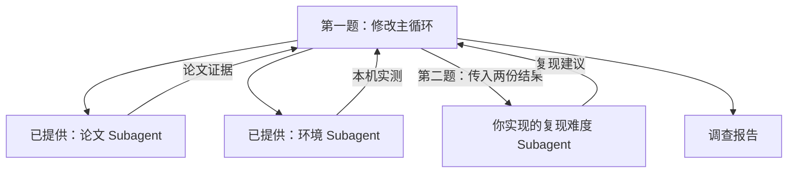

# Subagent 开发课：论文复现调查 Agent

你打算借助 Agent 复现一篇 AI 论文，却不知道该先让它做什么。要安排后面的代码和实验，先得查清论文用了什么模型、多少数据，以及自己的电脑能运行哪些计算。本课用这个场景练习 Subagent 开发：你补全程序，让 Main Agent 调用 Subagent 读论文、查环境，再根据工具结果给出复现建议。

作业分两题：

1. **改主循环，调用两个已写好的 Subagent。** 论文 Subagent 读 PDF，环境 Subagent 检查本机。你写的代码执行模型提出的任务请求，把两个 Subagent 的回答交回主循环。自动化测试检查调用和消息传递是否正确。
2. **自己实现复现难度 Subagent。** 读取 `knowledge/difficulty.md` 中已提供的工作说明，创建 Subagent，再把 Main Agent 传来的任务交给它运行。它根据前两份结果，使用数据目录检查和训练步数计算工具判断下一步。



## 从第一题开始

教学代码只有三个文件：

| 文件 | 用途 |
| --- | --- |
| `main.py` | 两题都在这里：修改 MainAgent.run，实现 run_difficulty |
| `agent.py` | 已提供：Subagent 使用的 Agent 循环、工具调用和 API 请求 |
| `tools.py` | 已提供：PDF、源码、数据目录与 PyTorch 工具 |

按[教程](docs/tutorial.md)先完成第一题，再做第二题。第一题可以独立运行，不需要先写复现难度 Subagent。

安装 [uv](https://docs.astral.sh/uv/getting-started/installation/) 后，在 macOS / Linux 终端准备作业环境：

```bash
git clone https://github.com/JackYansongLi/learn-harness.git
cd learn-harness
uv sync --locked
uv run pytest -m exercise1 -q
```

这些测试用预设回复代替 API 返回，并用替代函数测试部分工具调用，不需要密钥或 PyTorch。第一题未完成时，相关测试会失败。完成后，测试会检查请求是否传到两个 Subagent、对应工具函数是否执行、返回值是否进入主循环。真实本机检查要在下面的 API 运行中验证。

第二题写完后，用下面的命令检查新增 Subagent 和完整流程：

```bash
uv run pytest -m exercise2 -q
uv run pytest -q
```

## 以 AlexNet 论文为例，运行调查 Agent

测试通过后，再接入真实模型。仓库已包含 [AlexNet 原论文](examples/alexnet/paper.pdf)和单步实验，安装 PyTorch 并配置 DeepSeek 密钥即可运行：

```bash
uv sync --locked --extra ml
cp -n .env.example .env
# 打开 .env，填入 DEEPSEEK_API_KEY
uv run --extra ml python main.py --exercise 1 --trace
```

第一题用 `--exercise 1`，第二题改成 `--exercise 2`。不传 PDF 路径时，程序使用仓库里的 AlexNet 论文并启用配套实验。终端会打印任务、工具请求和结果；进度条显示当前 Agent、等待状态和已用时间。第一题有论文、环境、最终报告三个阶段，第二题加上难度判断，共四个阶段。

运行时检查 `--trace` 打印的工具请求和结果，确认论文读取、环境检查和模型单步实验都实际执行了，再打开 `output/report.md` 核对结论。单步实验用随机输入完成一次前向计算、反向传播和参数更新；论文准确率仍需真实数据上的训练和评估。报告是程序的输出，作业验收还要检查你修改的代码和实际调用过程。

### 实验用哪块设备？

上面的命令默认使用 `--device auto`，按 CUDA、MPS、CPU 的顺序选择可用设备。我用 macOS 演示，你按自己的电脑选择即可：

| 参数 | 用途 |
| --- | --- |
| `--device cuda` | 使用 NVIDIA GPU，需要 PyTorch 和驱动支持 CUDA |
| `--device mps` | 使用支持 MPS 的 Mac GPU；MPS 是 PyTorch 在 Mac 上使用 GPU 的后端 |
| `--device cpu` | 使用 CPU，不需要 GPU |

例如，想明确用 CPU，就在命令后加上设备参数：

```bash
uv run --extra ml python main.py --device cpu
```

明确指定 CUDA 或 MPS 后，如果设备不可用，工具会报告失败，不会自动换成 CPU。CUDA 安装包和驱动需要与本机匹配，安装方式见 [PyTorch 官方说明](https://pytorch.org/get-started/locally/)；是否可用以环境工具返回的 `cuda_available` 为准，MPS 则看 `mps_available`。

## 换成自己的论文

AlexNet 论文是课堂案例。要调查其他论文，把 PDF 路径传给程序。第二题完成后，还可以指定数据目录，让复现难度 Subagent 检查：

```bash
uv run --extra ml python main.py \
  --pdf /path/to/your-paper.pdf --trace

# 第二题完成后，指定源码文件和数据目录
uv run --extra ml python main.py \
  --exercise 2 \
  --pdf /path/to/your-paper.pdf \
  --code /path/to/model.py --dataset /path/to/dataset
```

`--pdf` 接收不超过 20 MB、能够提取文字的 PDF，暂不支持扫描件 OCR。`--code` 只读取指定源码文件，两题都可使用。第二题的 `--dataset` 指定数据根目录，工具检查其下并列的 `train/类别名/` 和 `val/类别名/`，不验证图片、标签或完整性。工具读出的文字、代码和环境结果会随请求发给 DeepSeek。

换 PDF 后，Agent 仍能读论文和检查环境，但要实际运行那篇论文的模型，还得提供对应实验函数。目前只注册了 AlexNet 实验，由 `--experiment alexnet` 开启；不传 `--pdf` 时会自动启用它；传入其他 PDF 时不会自动运行 AlexNet。

普通入口也接受 `--device`。需要查看调用过程时加 `--trace`；需要关闭进度条时加 `--no-progress`，报告照常输出。

## 用真实调用验收

完成代码后，按题号运行在线验收。它会重新启动一次调查，检查参与的 Agent 是否实际使用了各自的工具：

```bash
uv run --extra ml python -m tests.smoke --exercise 1
# 第二题完成后
uv run --extra ml python -m tests.smoke --exercise 2
```

验收代码都在 `tests/`，你无需修改。验收也接受 `--device cuda`、`--device mps`、`--device cpu`。调查返回结果后，本次验收会覆盖 `output/smoke.json` 和 `output/report.md`；是否通过，以命令结果和记录中的 `checks` 为准。它检查执行过程；报告里的论文结论仍需回到原文核对。

普通运行和在线验收都会消耗 API 额度。API 使用 `deepseek-flash`，对应 DeepSeek V4.1 Flash，见 [DeepSeek 模型表](https://api-docs.deepseek.com/quick_start/pricing/)。本课关闭 thinking。密钥放在本地 `.env`，生成文件放在 `output/`，两者都不会提交。
