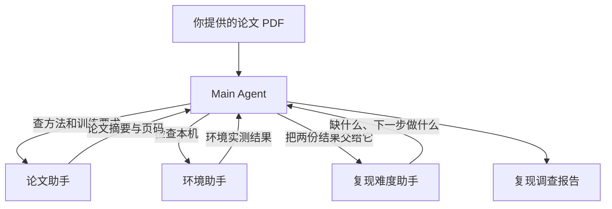

# Subagent 开发课：论文复现调查助手

你打算借助 Agent 复现一篇 AI 论文，却不知道该先让它做什么。要安排后面的代码和实验，先得查清论文用了什么模型、多少数据，以及自己的电脑能运行哪些计算。本课就从这项调查开始：输入论文 PDF，让 Agent 读论文、查环境，最后给出复现建议。

这项任务分给三个 Subagent：论文助手查原文，环境助手检查本机，难度助手比较两边的条件。难度助手需要前两项的结果，因此由 Main Agent 先收集论文和环境信息，再交给它判断，最后整理报告。



这些任务都通过 `agent.py` 中 `run()` 的循环执行：每轮请求模型，有工具请求就执行并继续，没有工具请求就检查回答并返回。Main Agent 请求 task 时，会等另一个 Agent 跑完自己的循环，再带着结果继续。

## 补上子助手调用，再运行调查

教学代码只有三个文件：

| 文件 | 你需要看什么 |
| --- | --- |
| `agent.py` | 在 spawn_subagent 中补两处代码；循环、工具调用和 API 请求已提供 |
| `main.py` | 三位专家的配置、程序入口和进度条 |
| `tools.py` | PDF、源码、数据目录与 PyTorch 工具，已写好 |

按[教程](docs/tutorial.md)看主助手怎样进入子助手的循环，再补全 `spawn_subagent` 中的两处代码：创建子助手，调用它的 `run()`。公开仓库暂不提供答案，初始代码会在 TODO 处停止。

安装 [uv](https://docs.astral.sh/uv/getting-started/installation/) 后，在 macOS / Linux 终端准备作业环境：

```bash
git clone https://github.com/JackYansongLi/learn-harness.git
cd learn-harness
uv sync --locked
uv run pytest -q
```

测试使用预设模型回复，不需要密钥或 PyTorch。两处代码还没写完时，子助手调用相关的测试会失败；写完后重新运行，检查它是否用自己的工作说明和工具完成任务，再把回答交回主助手。

## 以 AlexNet 论文为例，运行调查助手

测试通过后，再接入真实模型。仓库已包含 [AlexNet 原论文](examples/alexnet/paper.pdf)和单步实验，安装 PyTorch 并配置 DeepSeek 密钥即可运行：

```bash
uv sync --locked --extra ml
cp .env.example .env
# 打开 .env，填入 DEEPSEEK_API_KEY
uv run --extra ml python main.py --trace
```

不传 PDF 路径时，程序使用仓库里的 AlexNet 论文并启用配套实验。终端会打印任务、工具请求和结果；进度条显示当前助手、等待状态和已用时间，按论文、环境、难度、最终报告四个阶段更新。

结束后打开 `output/report.md`。报告中的环境结论来自本机工具：它用随机输入完成一次前向计算、反向传播和参数更新。这能检查模型是否跑得通；论文准确率仍需真实数据上的训练和评估。

### 实验用哪块设备？

上面的命令默认使用 `--device auto`，按 CUDA、MPS、CPU 的顺序选择可用设备。我用 macOS 演示，你按自己的电脑选择即可：

| 参数 | 用途 |
| --- | --- |
| `--device cuda` | 使用 NVIDIA GPU，需要 PyTorch 和驱动支持 CUDA |
| `--device mps` | 使用支持 MPS 的 Mac GPU；MPS 是 PyTorch 在 Mac 上使用 GPU 的后端 |
| `--device cpu` | 使用 CPU，不需要 GPU |

例如，想明确用 CPU，就在命令后加上设备参数：

```bash
uv run --extra ml python main.py --device cpu
```

明确指定 CUDA 或 MPS 后，如果设备不可用，工具会报告失败，不会自动换成 CPU。CUDA 安装包和驱动需要与本机匹配，安装方式见 [PyTorch 官方说明](https://pytorch.org/get-started/locally/)；是否可用以环境工具返回的 `cuda_available` 为准，MPS 则看 `mps_available`。

## 换成自己的论文

AlexNet 只是课堂案例。要调查其他论文，把 PDF 路径传给程序；如果还有实现代码或数据目录，可以一起提供：

```bash
uv run --extra ml python main.py \
  --pdf /path/to/your-paper.pdf --trace

# 有实现代码和数据目录时，可以一并指定
uv run --extra ml python main.py \
  --pdf /path/to/your-paper.pdf \
  --code /path/to/model.py --dataset /path/to/dataset
```

`--pdf` 接收不超过 20 MB、能够提取文字的 PDF，暂不支持扫描件 OCR。`--code` 只读取指定源码；`--dataset` 检查 ImageFolder 格式的 `train/val/类别名/` 目录，不判断数据集是否完整。工具读出的文字、代码和环境结果会随请求发给 DeepSeek。

换 PDF 后，助手仍能读论文和检查环境，但要实际运行那篇论文的模型，还得提供对应实验函数。目前只注册了 AlexNet 实验，由 `--experiment alexnet` 开启；不传 `--pdf` 时会自动启用它；传入其他 PDF 时不会自动运行 AlexNet。

普通入口也接受 `--device`。需要查看调用过程时加 `--trace`；需要关闭进度条时加 `--no-progress`，报告照常输出。

## 用真实调用验收

报告生成后，再运行在线验收，检查三位助手是否实际调用了各自的工具：

```bash
uv run --extra ml python -m tests.smoke
```

验收代码都在 `tests/`，你无需修改。验收也接受 `--device cuda`、`--device mps`、`--device cpu`，记录保存在 `output/smoke.json`。它检查执行过程；报告里的论文结论仍需回到原文核对。

普通运行和在线验收都会消耗 API 额度。API 使用 `deepseek-flash`，对应 DeepSeek V4.1 Flash，见 [DeepSeek 模型表](https://api-docs.deepseek.com/quick_start/pricing/)。本课关闭 thinking。密钥放在本地 `.env`，生成文件放在 `output/`，两者都不会提交。
