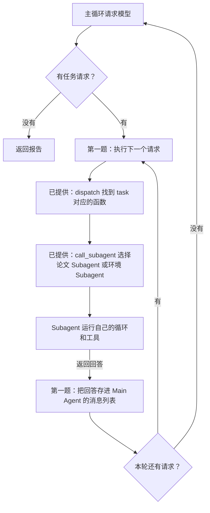
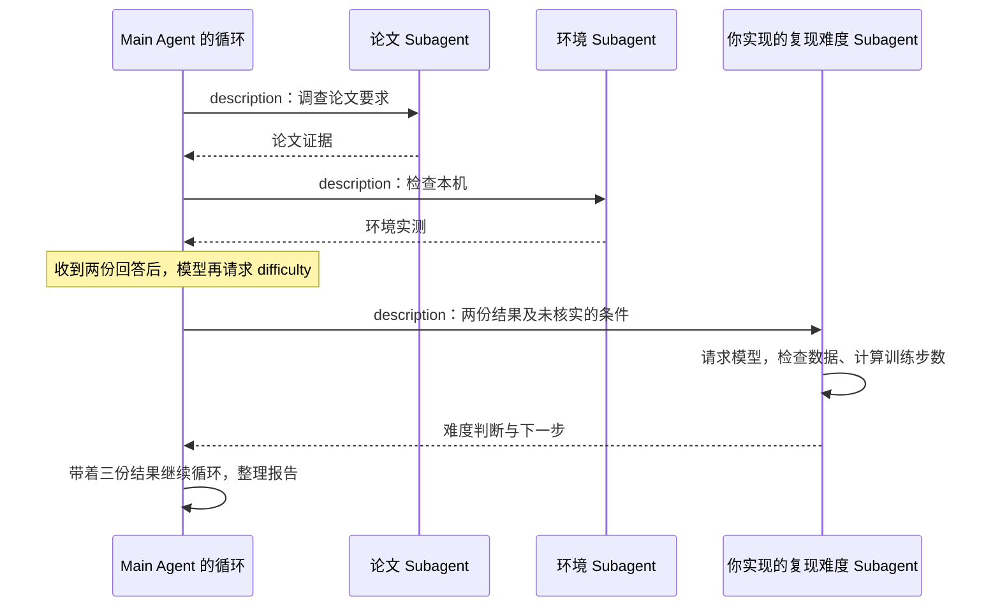
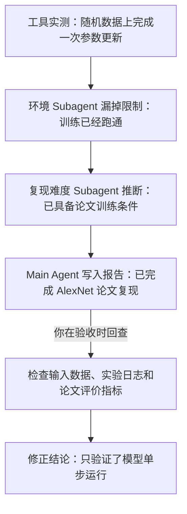
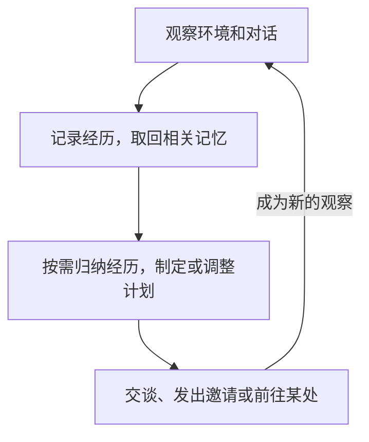

# AI Agent 开发实操课: Subagent

你打算借助 Agent 复现一篇论文，却不知道该先让它做什么：模型和训练设置要从论文哪里查？机器的配置是否可以支撑实验？准备哪些数据？如何配置环境先查清这些问题，才能安排后面的代码和实验。

本课用这个场景练习 Subagent 开发。**你要补全的是 Agent 程序：在主循环中调用 Subagent，再自己创建一个带有工具的 Subagent。** Main Agent 负责分配任务和汇总回答；三个 Subagent 各司其职，负责衡量难度，检查环境配置，阅读论文。

你可以用仓库中的[AlexNet 论文 PDF](../examples/alexnet/paper.pdf)测试你写的程序。

> **补充知识：AlexNet** AlexNet 是一种用于图像分类的深层卷积神经网络。Alex Krizhevsky、Ilya Sutskever 和 Geoffrey Hinton 在 2012 年的论文 [《ImageNet Classification with Deep Convolutional Neural Networks》](https://papers.nips.cc/paper/2012/file/c399862d3b9d6b76c8436e924a68c45b-Paper.pdf)中介绍了它。同年，团队以该模型为基础的参赛系统赢得 ImageNet 大规模视觉识别挑战赛（ILSVRC 2012）的图像分类冠军，展示了用 GPU 训练深层网络处理大规模图像分类的能力。这篇文章宣告 Deep Learning 这个技术路线的成功，引爆了之后的大模型时代。我想世界历史会以这个时间点作为一个重要节点。

这次的实操作业分成两题，都在 `main.py` 中。第一题先调用已经写好的 Subagent，第二题再创建新的 Subagent：

| 题目                          | 已经提供                                                  | 你要实现                                                                           |
| ----------------------------- | --------------------------------------------------------- | ---------------------------------------------------------------------------------- |
| 第一题：调用两个 Subagent     | 论文 Subagent、环境 Subagent，以及它们的工具和循环        | 补全 `MainAgent.run()`：执行模型提出的任务请求，把两个 Subagent 的回答交回主循环   |
| 第二题：增加复现难度 Subagent | `knowledge/difficulty.md`、数据目录检查和训练步数计算工具 | 实现 `MainAgent.run_difficulty()`：读取工作说明，创建 Subagent，运行任务并返回回答 |

补全后的程序应通过工具完成下面三项调查。第一题完成前两项，第二题增加第三项：

1. **论文 Subagent 查论文要求。** 读取 PDF，查清 AlexNet 的模型结构、数据量和训练设置，返回结论及原文页码。
2. **环境 Subagent 检查极其环境配置。** 调用工具检查 PyTorch 和可用设备，并运行已提供的 AlexNet 单步实验：用一批随机数据完成前向计算、反向传播和一次参数更新。
3. **复现难度 Subagent 判断还缺什么。** 接收前两份回答，检查指定的数据目录、按已查到的训练参数计算步数，再说明哪些条件已检查、哪些仍未核实。

Main Agent 根据这些返回结果生成报告，已提供的入口代码会将报告保存到 `output/report.md`。**作业验收看的是你修改的代码和实际调用过程，只有一份报告不能证明完成了作业。** 你还需要运行测试，确认主循环确实调用了 Subagent，并把它们的回答交回模型。

前面的课讲过，Agent 开发就是在 loop 里加条件：有工具请求就执行，把结果交回模型，再进入下一轮；没有工具请求就返回答案。这次要接上的，是循环中的 Subagent 调用。Main Agent 分配任务后等待，Subagent 运行自己的循环并返回回答，Main Agent 再带着这份回答继续。

> **什么时候需要多个 Agent，什么时候一个就够了？**
>
> 可以先问：**另一个 Agent 带来了原先那次回答没有用到的证据吗？** 重读同一段文字可能发现问题，但多了一次讨论并不等于多了一份证据。测试结果、渲染截图和外部查询结果，只有类似这样路径获取的文本才提供了可以核对的材料。
>
> **多 Agent 协作方式的信息增量对比**
>
> | 协作方式 | 是否引入新证据 | 能帮助检查什么 |
> | --- | --- | --- |
> | 同一模型重读自己的输出 | 没有新增外部证据 | 检查表述和推理，也可能重复原有错误 |
> | 不同 Agent 讨论同一段文本 | 若都只看原文，就没有新增外部证据 | 比较不同解释；结论仍需核实 |
> | Agent 根据测试结果审查代码 | 有执行结果 | 检查测试覆盖的行为是否符合要求 |
> | Agent 查看渲染截图，审查前端或 PPT | 有视觉结果 | 检查页面是否重叠、截断或排版错误 |
> | Agent 用外部工具核对事实 | 有查询结果 | 用来源核对原来的说法 |
>
> 这些方法是否有效，要看具体任务和检查是否可靠，不能只凭 Agent 数量判断。单个 Agent 也能调用上述工具。本课拆出论文 Subagent 和环境 Subagent，是让它们分别处理一项任务，并在各自本次运行的消息列表里记录工具结果，最后只把回答交给 Main Agent。

> **Question：Subagent 的上下文是否和 Main Agent 共享？**

> **Question**: 一群 Agent 一起写代码然后抽一个最好的 v.s. 一半的 Agent 写代码 + 一半的 Agent 写测试 & 给代码纠错，哪个效果好？

> **多 Agent 有哪些分工模式？**
>
> 本课采用的是**管理者模式**：Main Agent 决定把任务交给谁，Subagent 完成后把结果交回来，下一步仍由 Main Agent 决定。另一种是**去中心化交接**：一个 Agent 把后续工作交给另一个 Agent，由后者接着处理，不必每一步都回到同一个管理者。[OpenAI 的 Agent 开发指南](https://cdn.openai.com/business-guides-and-resources/a-practical-guide-to-building-agents.pdf#page=17)区分了这两种方式。
>
> 2026 年 7 月，**Graph Engineering** 这个说法受到关注。它讨论的是怎样把执行流程设计成图：方框表示一个工作步骤，箭头表示接下来执行什么、满足什么条件才能继续；同时规定各步骤传递哪些数据。方框里仍然可以运行我们熟悉的 Agent loop。[LangChain 在 7 月 22 日的文章](https://www.langchain.com/blog/3-years-of-graph-engineering-with-langgraph)解释了这个说法，也指出这种做法早已有之。
>
> 所以，Graph Engineering 不等于去中心化。管理者统一分配任务，也可以画成图；Agent 之间直接交接，也可以画成图。是否有管理者、消息怎样共享，是设计时要分别决定的两件事。

> **Agent 虚拟文件系统的四类区域**
>
> 如果要为多个 Agent 安排文件访问，可以参考下面四类区域。它们可以同时存在；表中的权限和保留时间是一种设计，需要由程序实现。
>
> | 区域 | 谁能访问 | 保留多久 | 读写 | 多个 Agent 同时修改时怎么办 |
> | --- | --- | --- | --- | --- |
> | Agent 专属工作区 | 仅该 Agent | 随 Agent 实例销毁 | 读写 | 私有区域，不需要协调其他 Agent |
> | 多 Agent 共享空间 | 所有协作 Agent 和用户 | 随任务保留，需要保存到持久存储 | 读写 | 需要协调，例如乐观锁或 worktree |
> | 外部挂载资源 | 由外部授权决定 | 由外部资源决定 | 多为只读，写入需谨慎 | 由外部资源负责 |
> | 系统内置资源 | 所有 Agent | 跨会话保留 | 只读 | 不会同时写入，不需要协调 |
>
> 乐观锁是在写入前检查文件有没有被别人改过，避免覆盖对方的修改；Git worktree 则让各个 Agent 先在不同的代码目录中修改，再合并结果。
>
> **本项目直接读取本地文件，使用的是内置资料和外部输入这两类资源。** 按用途可以对照表中的“系统内置资源”和“外部挂载资源”，但本课没有另做虚拟文件系统或挂载操作：
>
> - **外部资源**：你通过 `--pdf`、`--code` 指定的论文和源码文件，由论文 Subagent 读取；通过 `--dataset` 指定的数据目录，由复现难度 Subagent 检查。工具只读取这些文件或检查目录，不修改它们。
> - **内置资源**：仓库自带 AlexNet 论文 PDF，以及 `knowledge/` 中的 `paper.md`、`environment.md`、`difficulty.md` 三份工作说明。这些文件会一直保存在仓库中，程序运行时只读取。本课按分工提供资料：论文给论文 Subagent，每份工作说明加载给对应的 Subagent，并非表中“所有 Agent 都能访问”的完整实现。
>
> 本课没有为每个 Agent 建立专属文件目录，也没有让它们通过共享文件交换结果。Subagent 的回答通过函数返回值交给 Main Agent；`output/report.md` 则由 `main.py` 在调查结束后统一保存。各自的 `messages` 是内存中的对话记录，不是文件工作区。Subagent 按顺序运行，也没有写文件工具，因此这里不需要锁或 worktree 来协调它们的文件修改。

> **OpenAI 的 Navier–Stokes（NS）方程研究用了哪种模式？花了多少钱？**
>
> OpenAI 在 2026 年 9 月 8 日报告，其多 Agent 系统找到了光滑外力作用下 NS 方程有限时间爆破的证明。这里“爆破”是指数学解在有限时间内出现速度无界增长。
>
> 按[官方披露](https://openai.com/index/navier-stokes-solution/)，Agent 被分成多个组，组内可以通信，各组探索不同思路；研究团队再用 Codex 汇总有用的中间结果，交给其他组继续研究。可以把这种做法描述为**分组协作、跨组汇总**，但官方没有把它命名为某种固定模式，不能直接断言它就是去中心化或 Graph Engineering。
>
> 得到 NS 结果的组有**约一万个并发 Agent**；从首批 Agent 启动到得到结果，经过了**约 88 小时**，之后用 Lean 做形式化与验证又用了 **17 小时**。证明搜索使用内部模型，官方明确后续 Lean 阶段使用 GPT-6 Astra；没有披露实际费用，也没有说明后 17 小时仍有一万个并发 Agent。
>
> 下面另作一个课堂假设：一万个 Agent 全部使用 GPT-6 Astra，连续工作 $88+17=105$ 小时。在后面的用量假设下，模型费用约为 **1,300 万美元**。这不是这次研究实际采用的配置。
>
> API 按 token 用量收费，只有运行时长还算不出费用。这里假设每个 Agent 平均每秒生成 **50 个计费输出 token**，累计输入量为输出量的 **2 倍**。按 [OpenAI 官方价格](https://developers.openai.com/api/docs/models/gpt-6-astra)（2026-09-17 查询），标准模式下每百万输入 token 为 **10 美元**，输出为 **50 美元**；本次按每个请求的输入不超过 272K token、输入均未命中缓存计算。
>
> - 输出量：$10,000 \times 105 \times 3,600 \times 50 = 1,890$ 亿 token，费用 **945 万美元**。
> - 输入量：$1,890 \times 2 = 3,780$ 亿 token，费用 **378 万美元**。
> - 合计：$945+378=1,323$ 万美元，约 **1,300 万美元**。
>
> 每秒 50 token 和输入输出比都是为了估算而选的数值，不是 Astra 的实测速率。保持其他假设不变，每秒速率改成 25 或 100 token，费用就分别约为 **660 万或 2,650 万美元**。这里仅算模型 token 费用，不含工具和运行环境费用，也不代表 OpenAI 这次研究的实际成本。
>

> Question: [Soft analysis, hard analysis, and the finite convergence principle](https://terrytao.wordpress.com/2007/05/23/soft-analysis-hard-analysis-and-the-finite-convergence-principle/)

回到第一题：先找到已经写好的两个 Subagent，再看主循环怎样调用它们。

## 1. 先看已经写好的两个 Subagent

打开 `main.py`，找到 `build_parent()`。这里准备了两个 Subagent：

| Subagent                   | 工作说明                   | 能调用的工具                                                                             |
| -------------------------- | -------------------------- | ---------------------------------------------------------------------------------------- |
| paper，论文 Subagent       | `knowledge/paper.md`       | 读取 PDF、查找关键词；可读取指定源码，启用 AlexNet 实验时还可读取 torchvision 的模型实现 |
| environment，环境 Subagent | `knowledge/environment.md` | 检查 PyTorch 和可用设备；选择 AlexNet 实验时还能运行模型单步检查                         |

**每个** Subagent 都是一个 `Agent` 对象。创建时，把模型调用对象、工作说明和工具交给它；调用它的 `run(任务)`，它就进入 `agent.py` 中已经写好的循环：请求模型，有工具请求就执行，再把结果交回模型。

`build_parent()` 返回 Main Agent。如果将它命名为 `parent`，那么 `parent.subagents["paper"]` 就是论文 Subagent。调用它的 `run("读取论文第 1 页，说明研究的问题")` 后，模型会收到这个任务及可用工具说明，再决定调用工具还是直接回答。

这两个 Subagent 共用 API 客户端，但各自使用自己的工作说明和工具。每次调用 `run()`，都会新建消息列表，所以环境 Subagent 不会自动看到论文 Subagent 读过的文字。

## 2. 第一题：让主循环调用它们

上一节的两个 Subagent 已经能独立工作：一个读论文，一个检查本机。现在要让 Main Agent 用上它们。假设你提交的任务是“调查这篇论文在本机的复现条件”，Main Agent 的模型决定先查论文，再检查机器。接下来，谁来执行这个决定？执行完，又怎样让模型知道结果？第一题要补的就是这两步。

先打开 `main.py`，找到 `class MainAgent(Agent)`，再往下找到它的 `run()`。里面有一处第一题 TODO，目前用 `raise NotImplementedError(...)` 占位，程序运行到这里就会停下来。先记住这个位置，我们从函数开头读起，看它为什么会走到这里。

### 先分清：这次运行的是谁的 `run()`？

你会发现 `main.py` 和 `agent.py` 都有一个 `run()`。它们属于不同的类，用途也不同：

- `main.py` 中的 `MainAgent.run()` 负责 Main Agent 的循环。第一题在这里补代码。
- `agent.py` 中的 `Agent.run()` 是已经写好的循环。论文 Subagent 和环境 Subagent 都是 `Agent` 对象，调用它们的 `run()` 就会进入这里。

沿用上一节的名字，假设 `parent` 保存 Main Agent，那么调用 `parent.run(prompt)` 时，就会进入 `MainAgent.run()`。这里的 `prompt` 是交给它的任务，`self` 则指 `parent` 这个对象。函数中的 `self.model`、`self.tools`，就是这个 Main Agent 保存的模型调用对象和工具。

再看 `MainAgent(Agent)` 这对括号。它表示 Main Agent 可以沿用 `Agent` 已有的方法，这在 Python 中叫“继承”。例如，`MainAgent` 没有另写 `dispatch()`，调用 `self.dispatch(...)` 时就会使用 `Agent` 中的实现。`run()` 则在 `MainAgent` 中重新写了一份，所以 `parent.run(...)` 会使用这一份。**调用哪个对象的方法，就先看这个对象所属的类提供了什么。**

### 第一次请求模型时，发给它什么？

看 `MainAgent.run()` 的开头：

```python
messages = [
    {"role": "system", "content": self.system},
    {"role": "user", "content": prompt},
]
```

`messages` 是这次任务的消息列表。开始时只有两条：第一条是 Main Agent 的工作说明，要求它先找论文 Subagent 和环境 Subagent；第二条是你交给它的任务。此时还没有调查结果，因为 Subagent 还没有运行。

接下来，程序进入外层循环：

```python
for _ in range(self.max_turns):
    answer = self.model.complete(
        messages,
        [t.schema() for t in self.tools.values()],
    )
    messages.append(answer)
```

先看中间的 `complete(...)`。它带着当前的 `messages` 请求模型，同时告诉模型有哪些工具可用。方括号里的代码会逐个取出 `self.tools` 中的工具，用 `schema()` 生成工具说明，包含名称、用途和参数格式。第一题的 Main Agent 只有一个工具，名叫 `task`，用来分配子任务。

模型收到的是这些说明。真正执行工具的 Python 函数保存在程序里，稍后再调用。模型本轮的回复存进 `answer`，紧接着的 `messages.append(answer)` 把回复记下来，后面继续请求模型时还要带上它。这里的 `append` 只是保存记录；下一次执行 `complete(...)`，才会再次发送消息。

最外面的 `for` 让这个过程能够重复。`self.max_turns` 限制 Main Agent 最多请求模型多少轮；下划线 `_` 表示这里不需要使用轮次的编号。之所以要重复，是因为第一次回复可能只是“请先查一下论文”。等论文查完，还要带着结果再问模型，才能继续完成调查。

### 模型回复了，为什么还不能直接返回？

程序接着看这条回复里有没有工具请求：

```python
calls = answer.get("tool_calls") or []
```

`tool_calls` 保存模型本轮提出的工具请求。没有这个字段，或者它的值为空时，就用空列表 `[]`。后面的 `if not calls` 处理这种情况：检查文字回答是否有效，然后用 `return text` 结束本次任务。这部分已经写好。

如果 `calls` 里有内容，就说明模型还要求程序执行工具。此时应该先完成这些请求，再让模型看到结果。本课中，模型可以通过 `task` 指定一个 Subagent，并说明让它做什么。

例如，模型可能在一轮中提出两个请求。为了先看懂它们的意思，可以把请求读成下面的样子；这是便于阅读的简写，项目里没有一个叫 `task()` 的 Python 函数：

```text
task(agent_type="paper", description="查清模型结构和训练设置，注明页码")
task(agent_type="environment", description="检查 PyTorch 和本机可用设备")
```

`agent_type` 指定找谁：`paper` 是论文 Subagent，`environment` 是环境 Subagent。`description` 是交给这个 Subagent 的任务。模型返回这些名字和文字时，两个 Subagent 都还没开始执行。

要把请求执行起来，程序就用到了内层的 `for call in calls`。`calls` 是本轮的请求列表，`call` 是正在处理的其中一条。如果列表里先放论文请求、再放环境请求，程序就先等论文 Subagent 完成，再执行环境请求。**这里是按顺序执行，一轮有两个请求不表示同时运行两个 Subagent。**

模型也可能第一轮只请求论文 Subagent，拿到回答后，第二轮才请求环境 Subagent。所以你要处理的是模型实际返回的 `calls`，不能把程序写成固定调用一次论文、再调用一次环境。两层循环在这里分工：外层负责一轮轮请求模型，内层负责做完当前这轮回复里要求做的事。

### 拿一条请求，沿着代码找到论文 Subagent

现在看内层循环取出的 `call`。下面是一条示例请求，格式和程序收到的一样：

```python
call = {
    "id": "call_paper_1",
    "type": "function",
    "function": {
        "name": "task",
        "arguments": '{"agent_type": "paper", "description": "查清模型结构和训练设置，注明页码"}',
    },
}
```

`name` 指明要使用 `task` 工具。`arguments` 保存工具参数，内容是一个 JSON 格式的字符串；其中 `agent_type` 的值是 `paper`。`id` 则用来对应这次请求和稍后的结果：结果返回时，要让模型知道它回答的是哪一次请求。

接下来需要调用 `self.dispatch(call)`。`dispatch` 这个名字在这里可以理解为“执行这条工具请求”。它已经写在 `agent.py` 中，你不需要实现它，但要看懂它怎样找到目标。沿着这条论文请求，执行过程有四步。

**第一步：根据工具名，找到 `task` 的记录。** 打开 `Agent.dispatch()`，看开头两行：

```python
name = call["function"]["name"]
tool = self.tools.get(name)
```

对于上面的例子，`name` 是 `"task"`，所以找到的是 Main Agent 的 `self.tools["task"]`。注意，虽然方法写在 `Agent` 类里，这次调用中的 `self` 仍然是 Main Agent；程序还没有进入论文 Subagent。

**第二步：找到这个工具保存的执行函数。** 回到 `main.py` 的 `MainAgent.__init__()`，找到 `self.tools["task"] = Tool(...)`。创建这个工具时，最后传入的是 `self.call_subagent`。这里没有括号，表示先把函数保存起来，等收到请求再执行。

这几行在创建 Main Agent 时就执行过了；我们现在回看它们，是为了弄清工具里保存了哪个函数。

`Tool` 把这个函数存放在名叫 `handler` 的字段里。你在 `dispatch()` 中看到的 `tool.handler`，在这一次调用里就是 Main Agent 的 `call_subagent`。因此，模型只需要返回工具名 `task`，程序就能找到要执行的函数。

**第三步：读出参数，再调用函数。** `dispatch()` 用 `json.loads(...)` 把 `arguments` 字符串读成字典，检查参数后，执行：

```python
return tool.handler(**args)
```

这里 `**args` 表示把字典里的内容作为函数参数传进去。对于这条请求，就是把 `agent_type="paper"` 和那句任务说明交给 `call_subagent()`。

**第四步：选中论文 Subagent，进入它自己的循环。** 在 `MainAgent.call_subagent()` 中，你能找到：

```python
summary = self.subagents[agent_type].run(description)
```

这时 `agent_type` 是 `"paper"`，所以取出的就是前面创建的论文 Subagent。它是一个 `Agent` 对象，调用它的 `run(description)`，会进入 `agent.py` 的 `Agent.run()`。从这里开始，那次 `run()` 中的 `self` 指向论文 Subagent；它使用自己的工作说明、工具和新建的消息列表，可以请求模型、读取 PDF，再带着读到的内容继续循环。

### Subagent 返回后，程序接着去哪？

论文 Subagent 工作期间，Main Agent 会停在调用它的位置等待。等它的 `run()` 返回文字回答，这份回答就沿着刚才的调用顺序往回走：

```text
论文 Subagent 的 run() 返回回答
    → Main Agent 的 call_subagent() 收到回答，过长时截短
    → Main Agent 的 dispatch() 返回这份结果
    → MainAgent.run() 的内层循环拿到结果
```

论文 Subagent 的 `return` 只结束它自己的这次运行。Main Agent 的任务还没有结束：如果本轮还有环境请求，就继续执行；本轮请求全部处理完，才进入外层下一轮，再次调用模型。

这也解释了为什么第一题除了“执行请求”，还要“保存结果”。如果不把 Subagent 的回答放回 Main Agent 的 `messages`，下一轮请求模型时，它就看不到刚才查到了什么。论文 Subagent 内部读 PDF 的原始记录留在它自己的消息列表里，返回给 Main Agent 的是最后整理出的回答。

你补完第一题后，主循环应当按下面的路线继续运行。图中标了“第一题”的两处，就是你要接上的步骤：



### 你要补什么？

找到 `for call in calls:` 下的第一题 TODO，替换掉 `raise NotImplementedError(...)`，完成两件事：

1. 调用 `self.dispatch(call)` 执行当前请求，取得回答或错误信息。
2. 把返回值作为一条工具结果，追加到 `messages`。

消息要包含这三个字段：

| 字段         | 填什么                                              |
| ------------ | --------------------------------------------------- |
| role         | 字符串 `"tool"`，表示这是工具返回的结果             |
| tool_call_id | 当前请求的 `call["id"]`，让模型知道回答对应哪个请求 |
| content      | `self.dispatch(call)` 返回的回答或错误信息          |

完成本轮所有请求后，继续循环，把这些回答发给 Main Agent 的模型。不要在收到第一份 Subagent 回答时就 `return`：它只是调查的一部分，Main Agent 还要根据结果继续工作。

一次 `run()` 执行期间，Subagent 用自己的消息列表记录模型回复和工具结果；这不是保存在磁盘上的长期记录。Main Agent 只接收它返回的回答，不要把两边的消息列表合在一起。

### 检查第一题

在仓库目录运行：

```bash
uv sync --locked
uv run pytest -m exercise1 -q
```

这些测试用预设回复代替 API 返回，并用可检查的替代函数测试部分工具调用。它们检查：

- 请求是否传到两个 Subagent，是否执行了各自对应的工具函数。
- 两份回答是否都进入主循环，是否对应正确的请求 id。
- 一轮请求两个 Subagent、分两轮请求，以及交换请求顺序时，是否都能完成。
- Subagent 的原始工具记录是否留在自己的消息列表里。

这些测试检查的是 Python 调用和消息传递，不会运行真实 PyTorch 实验。第一题未完成时，相关测试会失败。通过后，再安装 PyTorch、配置密钥，接入真实模型运行第一题：

```bash
uv sync --locked --extra ml
# 已有 .env 就跳过复制；打开文件，填入 DEEPSEEK_API_KEY
cp -n .env.example .env
uv run --extra ml python main.py --exercise 1 --trace
```

这条命令默认使用仓库中的 AlexNet 论文 PDF，并向环境 Subagent 提供单步实验工具。工具是否调用，仍由模型提出请求。查看 `--trace` 打印的任务、工具请求和结果，确认论文读取和实验都实际执行了，再检查 `output/report.md` 是否据此写出了结论。还要找到两个 Subagent 返回后，Main Agent 继续请求模型的位置。第一题不调用复现难度 Subagent，可以独立运行。

## 3. 第二题：实现复现难度 Subagent

确认第一题已读到论文要求、完成本机检查后，还需要判断接下来做什么。例如，单步实验通过了，但你指定的数据目录是否具备预期结构？按论文给出的样本数、训练轮数和每批样本数，要更新多少次参数？第二题增加一个 Subagent，让它结合前两份回答调用工具，再给出有依据的建议。

打开 `MainAgent.run_difficulty(description)`，根据函数中的说明，用你的实现替换末尾的 `raise NotImplementedError(...)`。Main Agent 的工作说明已要求模型把前两份回答的关键证据写进 `description`；Python 代码只负责传递这个参数，不会自动补齐遗漏的内容。

工作说明已放在 `knowledge/difficulty.md`。你要像前两个 Subagent 一样，从文件读取工作说明，再创建 Subagent、运行任务并返回回答。可以参考 `build_parent()` 中读取 `knowledge/paper.md` 和 `knowledge/environment.md` 的代码。

### 读取工作说明

先打开 `knowledge/difficulty.md`。第一行“复现难度 Subagent”供进度条识别，后面规定它怎样使用论文和环境证据、何时调用两个工具，以及怎样给出建议。

`main.py` 中的 `KNOWLEDGE` 已指向这个目录。在 `run_difficulty()` 中，用 `read_text(encoding="utf-8")` 读取 `KNOWLEDGE / "difficulty.md"`，将文件内容作为 `system`。提示词只保留在 Markdown 文件中，函数负责读取和使用它。

### 创建并运行这个 Subagent

`self.difficulty_tools` 已经准备好这两个工具。用 `Agent` 创建 Subagent 时：

| 参数      | 使用什么                                     |
| --------- | -------------------------------------------- |
| model     | `self.model`，共用 Main Agent 的模型调用对象 |
| system    | 从 `knowledge/difficulty.md` 读取的文本      |
| tools     | `self.difficulty_tools`，只给它这两个工具    |
| max_turns | `self.max_turns`，限制它自己的循环次数       |

然后调用它的 `run(description)`，返回它的回答。不要直接返回写死的复现建议，也不要把 Main Agent 的 task 工具交给它。

这个 Subagent 不会自动看到前两次调查的消息。运行时检查传入的 `description`：里面应有论文中的数字和页码、本机检查结果，以及仍未核实的条件。不能只写“参考上文”，因为这个 Subagent 看不到 Main Agent 的上文。

下面画出一次可能的调用顺序。论文和环境两项可以交换顺序；复现难度 Subagent 需要等两份回答都返回后，再接收这些证据。



### 检查第二题

```bash
uv run pytest -m exercise2 -q
uv run --extra ml python main.py --exercise 2 --trace
```

上面的 `main.py` 命令没有传 `--dataset`，调用目录检查工具时应返回“未提供目录”。如果有数据，在这条命令后加 `--dataset /实际的数据目录`；数据目录下应分别有 `train/类别名/` 和 `val/类别名/` 两组子目录。

第二题测试既会单独调用你的复现难度 Subagent，也会检查三个 Subagent 一起工作的过程。它会检查发给模型的工作说明是否来自 `knowledge/difficulty.md`，再核对工具是否执行、参数是否传对、结果是否交回模型，以及新的任务是否从独立的消息列表开始。协作测试需要第一题也已完成。

预设回复能检查调用过程，不能保证真实模型始终按工作说明作出正确判断。运行后打开 `output/report.md`，对照论文、工具结果和传给复现难度 Subagent 的任务，检查结论是否有依据。

## 4. 最后验收与提交

两题完成后运行全部测试，再运行真实调用验收：

```bash
uv run pytest -q
uv run --extra ml python -m tests.smoke --exercise 2
```

如果只做完第一题，先运行 `uv run pytest -m exercise1 -q`，并把在线验收命令中的 `2` 改成 `1`。全部测试包含第二题，第一题完成时不要求它们全部通过。

在线验收会重新启动一次调查，使用真实 API，并要求 Agent 读取论文、检查环境、运行 AlexNet 单步实验。验收代码检查这些工具是否实际调用，以及本机实验是否通过；它不替你核对报告中的所有论文结论。运行需要密钥，也会消耗 API 额度。

调查返回结果后，验收会将记录写入 `output/smoke.json`，将报告写入 `output/report.md`，覆盖之前的同名输出。是否通过，要看命令结果和 `smoke.json` 中的 `checks`；有报告文件不代表验收通过。

运行和验收都支持 `--device cuda`、`--device mps`、`--device cpu`。CUDA 用于 NVIDIA GPU；MPS 是 PyTorch 在支持它的 Mac 上使用 GPU 的后端；CPU 不需要 GPU。我用 Mac 演示，你按自己的设备选择。默认 `auto` 按 CUDA、MPS、CPU 的顺序选择可用设备。明确指定的设备不可用时，实验工具返回不可用，在线验收不会通过，也不会自动改用其他设备。

课堂的 AlexNet 模型单步实验使用随机输入，完成一次前向计算、反向传播和参数更新。通过只能说明这一步跑通，不能当作达到了论文准确率。

提交修改后的 `main.py`、两题测试结果，以及第二题真实运行生成的 `output/report.md` 和 `output/smoke.json`。报告与记录用于检查你的程序怎样完成调查。结合这次调用记录回答：

1. 执行哪一行时，程序进入了 Subagent 的 `run()`？它返回后，Main Agent 接着执行哪一行？
2. Main Agent 和 Subagent 分别保存了哪些消息？
3. 复现难度 Subagent 收到了哪些论文和环境证据？哪条建议还需要进一步验证？

`agent.py`、`tools.py` 和测试都已提供，不需要修改。公开仓库暂不提供参考答案。

## 5. 一些哲学问题

一杯静止的水的速度是多少？你可能会脱口而出是 $0$，但是仔细想一下，这个问题的答案实际上取决于你看问题的角度。从分子级别的微观来看，即使是一杯静止的水，其中每个水分子也都在以百米每秒级的速度在运动着。但是当水分子的数量达到一定程度后，他们的平均速度却变成了 $0$，也就是你脱口而出的静止的水的速度。

> 补充知识：流体力学一个常见的假设便是连续介质假设，假设流体是连续的，而不是分子一粒粒这样离散组成的。有的教材会使用符号区分这种假想的流体中一个极小微团的速度和实际上构成流体的力学的速度，前者采用 $\vec{u}$，后者采用常见的 $\vec{v}$.

为什么在微观上看起来如此混乱的运动模式（百米速度），在宏观上看起来却如此和谐（静止）？

为什么在微观上需要用百万甚至亿个参数描述（每个粒子的速度，位移和粒子间的相互作用），在宏观上却只需要几个参数（温度，压强等）就可以描述清楚状态？

这个问题和 今年菲尔兹奖得主 邓煜的工作高度相关。百年之前，计算机架构的提出者，计算机硬件之父冯诺伊曼也致力于解决这个问题。但在这里我们 *不回答* 这个问题，我们只借鉴这个项目的比喻，来看一下 多智能体系统何时会失败。

### Agent 多了，判断就更可靠吗？

拿这杯水作个比方：水分子各自运动得很快，整杯水却未必朝某个方向流动。多个 Agent 也可能每个都在不停地回答，整个系统却没有更接近问题的答案。如果它们读的是同样的材料，又沿用彼此的判断，多出的回复就可能只是在重复同一个错误。让它们尝试不同思路当然可能有帮助，但接下来仍要回答：凭什么判断哪一种思路是对的？

要改变这杯水的状态，我们可以加热，也可以摇晃，让外界对它产生作用。沿着这个比喻想下去，设计多 Agent 时，我们也该看看它们能从外界得到什么。这里说的“环境”很具体：Agent 能读到哪些文档，能调用哪些工具，工具会返回什么结果。比如，只读 AlexNet 的论文，无法确认你这台电脑能不能运行模型；让 Agent 调用本机检查和单步实验工具，它才有这台电脑的实际运行结果，可以据此作出判断。

这也是本课安排三种 Subagent 的用意。论文 Subagent 查原文，回答论文要求什么；环境 Subagent 检查本机，回答机器实际能做什么；复现难度 Subagent 接收这两份结果，再检查数据目录、计算训练步数，判断哪些条件已经满足、哪些还缺、哪些仍需核实。它们可以使用同一个语言模型，分工的差别在于各自查什么、用什么工具，以及带回什么证据。

所以，“多样”要落实到这些具体差别上。给每个 Agent 起不同的名字，不会自动带来不同的证据；塞入更多材料，也不保证判断更准。材料要和任务有关，工具结果要能核对，下一轮回答还要真正用上这些结果。回头看你在第一题补的循环：把工具结果放回 `messages`，就是让模型下一轮有机会根据实际结果修正判断。以后再增加一个 Agent，也先想清楚：它要查什么，带回的结果能帮 Main Agent 决定什么？

### 错误也会在协作中被放大

前面讨论的是忙了很多轮，却没有得到更可靠的答案。还有一种更糟的情况：每经过一个 Agent，结论就离原始证据更远一步。

流体方程中的 **blow-up** 可以提供另一个比喻。在一维无黏 Burgers 方程这个简化的流动模型中，后面的流体若比前面的流得快，速度曲线可能越来越陡，最终在有限时间内出现无界的斜率。这里速度本身仍可有界，变得无界的是速度的空间变化率，也叫速度梯度。这是梯度的 blow-up：原先平滑的解失去了平滑性。具体推导可看 [ETH 课程讲义 §3.1](https://metaphor.ethz.ch/x/2019/hs/401-4671-00L/literature/mishra_hyperbolic_pdes.pdf#page=23)。

借这个例子看多 Agent：一次没有被发现的误读，可能被后面的 Agent 当作前提，继续推出更不可靠的结论。这里借用的是“逐渐放大”的直观印象，Agent 的错误仍要通过它实际传递的内容来分析。

以本课的单步实验为例。工具实际验证的是：用随机数据完成一次前向计算、反向传播和参数更新。假设环境 Subagent 在概括时漏掉“随机数据”和“一次”这两个限制，后面的 Agent 又都直接采信前一份回答，就可能出现下面这条错误链：



这里没有哪个 Agent 真正执行了完整训练，也没有测量论文要求的准确率，但报告已经声称复现成功。问题出在转述：Python 可以把一段回答原样传给下一个 Agent，模型却可能在概括、理解和继续推断时丢掉条件。“检查过其中一步”就这样变成了“整个任务已经完成”。

要发现这种错误，就得有人回头核对原始证据。检查时先看实验究竟用了什么数据、做了多少步、记录了哪些指标，再看最终结论能不能由这些结果支持。让另一个 Agent 承担检查也可以，但要让它直接读取这些材料，独立判断；如果只给它看前一个 Agent 的解释，再问“你同意吗”，它仍可能沿用同一个误解。

本课的复现难度 Subagent 接收的是前两份回答中的证据摘要，不能把它当作已经独立核查了所有原始结果。因此，图中最后的回查由你在验收时完成：对照论文、工具输出和报告，确认结论保留了证据中的限制条件。你写的 loop 能把结果传回来，但不会自动保证每次概括都保留了原文的条件。增加 Agent 时，除了安排谁来继续做，也要安排怎样发现前一步做错了。

### 涌现

涌现这个词诸位可能已经听吐了。不过，这里讨论的不是模型参数增加后出现什么能力，而是许多个 Agent 持续互动以后，会不会形成事先没有逐步安排过的集体行为。前面说了，错误可能沿着 Agent 之间的交流传播；同样的交流，也可能让它们传递消息、建立关系，最后共同完成一件事。

2023 年，斯坦福大学和 Google 的研究者做过一个这样的实验：把 25 个 Agent 放进虚拟小镇 Smallville，让它们在里面生活两个游戏日。小镇有住宅、商店和咖啡馆，每个 Agent 有各自的人物背景和日程，可以观察周围、与其他 Agent 交谈、决定接下来去哪里。具体设计见论文 [《Generative Agents》](https://arxiv.org/abs/2304.03442)。

要让这些行为接得上，Agent 得记得先前发生过什么。研究者为它们设计了三项机制：

1. **记住经历。** 把见闻和对话存下来，需要时按相关性、重要性和近期访问情况取回记录。下一次见面，就有机会接着上一次的话题聊。
2. **归纳经历。** 从零散记录中形成对人物、关系的判断，再写回记忆。这就是这里的“反思”，仍然是模型处理文字、生成新的记录。
3. **安排下一步。** 根据记忆和当前情况制定计划，遇到新的消息后再调整。收到邀请，可能就要改变原来的日程。

每个 Agent 都在反复观察、回忆和行动。它说了什么、去了哪里，又会成为其他 Agent 下一轮看到的信息：



论文里有个很具体的例子。研究者给咖啡馆店主 Isabella 设定了办情人节派对的意愿。接下来，她在交谈中邀请其他 Agent，消息又通过后续交谈传开。有的 Agent 帮忙布置，有的邀请别人一同赴约。除 Isabella 外，最后有 12 个 Agent 知道这场派对，5 个实际参加。[论文 §3.4.3 和 §7.1.2](https://arxiv.org/html/2304.03442v2)记录了这一过程。

研究者设定了人物、环境和办派对的意愿，却没有逐一规定谁去通知谁、谁必须到场。单看一个 Agent，它只是在根据自己的记忆和日程行动；把这些行动连起来看，却形成了一场多人参与的活动。这里说的“涌现”，指的就是这样的集体行为。角色和运行机制经过设计，具体的协调过程在互动中形成，两件事可以同时成立。

沿着这个方向，还可以换一种环境来研究。把 Agent 放进市场，观察它们怎样报价、交易和分配资源；让它们玩狼人杀，观察它们怎样在不知道他人身份时推理、结盟和隐瞒信息。派对、交易和狼人杀，分别让我们观察社交、经济和策略上的集体行为。要判断结果，就得看邀请是否传开、交易是否完成、策略是否奏效，不能只听 Agent 描述自己建立了怎样的“社会”。

回到本课，三个 Subagent 由 Main Agent 分配任务，每次 `run()` 都新建消息列表。AI 小镇则让经历延续下来，观察后续的互动。将来把规模扩大到成百上千，可以进一步问：哪些消息会扩散，哪些关系会稳定下来，合作又会怎样失败？这次小规模实验还不能证明，Agent 数量达到某个门槛，系统就会自动变得更智能。

## Paper2Agent

本课用到的工具都是提前写好的。比如，环境 Subagent 能运行 AlexNet 单步实验，是因为我们已经把这段实验代码做成了工具。换一篇论文，如果想让 Agent 运行其中的方法，就得有人找代码、装依赖，再写出相应的工具。

[Paper2Agent](https://www.nature.com/articles/s41586-026-11044-y)想把这部分工作也交给 Agent。它读取论文和对应仓库，运行作者的示例，把其中的分析步骤整理成函数，测试通过后供其他 Agent 调用。读者便可以带着自己的数据提出分析要求，由 Agent 调用这些函数完成计算。

> 论文题目是《Reimagining research papers as interactive and reliable AI agents》。下面的实验结果均为作者报告，我没有重新运行这些实验；源码按 2026 年 9 月 18 日读到的[仓库版本 `8c2d059`](https://github.com/jmiao24/Paper2Agent/tree/8c2d059165ef8cdcb70dbea76655b9c2b55b38e6)介绍。

### 它做了什么

论文用了 Scanpy 作为例子。Scanpy 是分析单细胞数据的软件，作者选取其中的预处理与聚类流程，让 Paper2Agent 生成了 7 个工具，并整理出调用顺序。用户提供数据路径后，连接这些工具的 Agent 就可以依次检查数据质量、做归一化、降维和聚类，返回分析结果。

生成并验证这 7 个工具，作者报告用了约 45 分钟、13 美元 API 费用。这笔费用花在准备工具上；之后处理新数据，还要支付模型调用和程序运行的成本。准备好的工具可以反复使用，后续分析就不必每次都从读源码、写调用代码开始。[论文 Fig. 3](https://www.nature.com/articles/s41586-026-11044-y#Sec4)

### 几个 Subagent 怎么配合

它的分工和本课类似：一个 Main Agent 分配任务，几个 Subagent 分别完成其中一部分。找到论文对应的仓库后，先配置环境、寻找可运行的示例，再执行示例、提取工具、测试和修复，最后把通过测试的工具放进 MCP 服务。同一阶段有多个独立示例时，可以并行处理。[论文 Methods](https://www.nature.com/articles/s41586-026-11044-y#Sec9)

这里先解释 MCP。我们在本课用 `Tool.schema()` 告诉模型工具叫什么、需要哪些参数，再用 `dispatch()` 执行调用。MCP 规定了一套统一的通信方式，让 Agent 能向另一个程序查询工具、传入参数、取得结果。Paper2Agent 把生成的函数放进这样的程序里，别的 Agent 接上它，就能调用这些函数。

但函数写出来之后，怎么知道它有没有改错原来的计算？Paper2Agent 在提取工具之前，先让一个 Subagent 把原仓库的示例跑一遍，保留数值、文件和图片。后面测试新函数时，就拿这些输出作比较。

负责实现工具的 Subagent 要把示例里写死的数据路径、阈值等改成参数，让函数能接收其他数据。负责测试的 Subagent 再用原来的输入调用它，检查输出文件、数值误差和图片是否符合参考结果。出错就修复，再运行；反复失败的函数会被排除。这里的 loop 有了明确的反馈：哪一步报错、哪个数值不符，决定了下一轮要改什么。



<details>
<summary>查看流程图源码</summary>

```text
flowchart TD
    A[论文及对应代码仓库] --> B[配置环境，寻找示例]
    B --> C[执行原示例<br/>保存数值、文件和图片]
    C --> D[把分析步骤整理成工具]
    D --> E[测试工具<br/>对照原示例的输出]
    E -->|失败且仍可修复| D
    E -->|通过| F[组装 MCP 服务]
    E -->|反复失败| X[记录原因<br/>排除该工具]
    F --> G[使用者的 Agent<br/>调用工具分析数据]
```

</details>

除了能执行的函数，论文还把阅读材料和操作说明一起放进 MCP 服务，分为三类：

- **Tools**：执行分析的函数。
- **Resources**：论文正文、补充材料、数据位置等资料。
- **Prompts**：多步分析的操作说明。例如 Scanpy 的预处理应该先调用哪个工具，再把结果交给哪个工具。

读资料、按说明选工具、执行后再看结果，这些仍然由使用它们的 Agent 完成。Prompts 只是说明步骤，本身不会执行计算。[论文 Fig. 1](https://www.nature.com/articles/s41586-026-11044-y#Sec2)

### 仓库从哪里读起

当前仓库用 skill 编排这些工作。你可以把 skill 理解成给现有 Agent 阅读的工作说明，附带一些脚本。Claude Code、Codex 等负责请求模型、启动 Subagent 和执行命令，Paper2Agent 则告诉它们怎样拆任务、交回哪些文件、怎样检查结果。因此，这个仓库没有像本课一样，再写一个 `MainAgent.run()`。

先读总入口，再看代码转换和 Subagent 分工：

| 文件                                                                                                                                                                                     | 里面写了什么                                                                                                                                                                                                                                       |
| ---------------------------------------------------------------------------------------------------------------------------------------------------------------------------------------- | -------------------------------------------------------------------------------------------------------------------------------------------------------------------------------------------------------------------------------------------------- |
| [`skills/paper2agent/SKILL.md`](https://github.com/jmiao24/Paper2Agent/blob/8c2d059165ef8cdcb70dbea76655b9c2b55b38e6/skills/paper2agent/SKILL.md)                                        | 论文和附件交给 `paper2skill`，代码仓库交给 `paper2mcp`。需要两类结果时，分别完成后再合在一起。                                                                                                                                                     |
| [`paper2skill/SKILL.md`](https://github.com/jmiao24/Paper2Agent/blob/8c2d059165ef8cdcb70dbea76655b9c2b55b38e6/skills/paper2agent/paper2skill/SKILL.md)                                   | 把 PDF、表格和图片整理成阅读资料，并对照原件检查。这部分不执行论文的方法。                                                                                                                                                                         |
| [`paper2mcp/SKILL.md`](https://github.com/jmiao24/Paper2Agent/blob/8c2d059165ef8cdcb70dbea76655b9c2b55b38e6/skills/paper2agent/paper2mcp/SKILL.md)                                       | 运行原仓库代码，提取工具，完成测试，最后打包 MCP 服务。                                                                                                                                                                                            |
| [`paper2mcp/references/orchestration.md`](https://github.com/jmiao24/Paper2Agent/blob/8c2d059165ef8cdcb70dbea76655b9c2b55b38e6/skills/paper2agent/paper2mcp/references/orchestration.md) | 谁先做、谁可以同时做、谁负责安装依赖、谁可以修改哪些文件。各类 Subagent 的工作说明在同目录的 [`agents/`](https://github.com/jmiao24/Paper2Agent/tree/8c2d059165ef8cdcb70dbea76655b9c2b55b38e6/skills/paper2agent/paper2mcp/references/agents) 中。 |

这里有一条要求和前面讨论的独立检查有关：**工具写完后，另开 Subagent 做核验。** 核验者必须与所有实现者不同，不能让原来的 Agent 在同一段对话里换个角色就算检查过了。它要拿到源码、参考输出和测试记录，自己作判断。

仓库还提供两个检查脚本。`verify_workflow.py` 核对 Agent 身份记录、阶段顺序、文件校验值；`verify_mcp_server.py` 启动 MCP 服务，检查工具列表和参数，传入验收用例后还会实际调用工具。这两种检查有各自的范围：记录齐全不代表计算正确，只列出工具也不代表调用成功。具体数值和图片仍要与原示例比较。[脚本目录](https://github.com/jmiao24/Paper2Agent/tree/8c2d059165ef8cdcb70dbea76655b9c2b55b38e6/skills/paper2agent/paper2mcp/scripts)

读仓库时也会发现，它与论文的组织方式已经有些不同。当前入口把阅读资料和可执行工具分开处理，MCP resources、工作流 prompts、远程部署列在[可选扩展](https://github.com/jmiao24/Paper2Agent/blob/8c2d059165ef8cdcb70dbea76655b9c2b55b38e6/skills/paper2agent/paper2mcp/references/extensions.md)中。按默认流程运行，不一定得到论文介绍的全部功能。

### 和本课的对应关系

| 本课中的代码或安排                                         | Paper2Agent 中对应的做法                                                                                                                  |
| ---------------------------------------------------------- | ----------------------------------------------------------------------------------------------------------------------------------------- |
| `MainAgent.run()` 分配任务，等 Subagent 返回后继续         | 协调 Agent 安排各项工作，还要检查返回的文件和测试结果，才能进入下一阶段。并行处理多个示例时，需要规定各自修改哪些文件、哪些结果必须等齐。 |
| 从 `knowledge/difficulty.md` 读取工作说明                  | 各类 Subagent 也有自己的工作说明；启动和工具调用由现有的编程 Agent 提供。                                                                 |
| 每次 `Agent.run()` 新建消息列表                            | 核验工作交给另开的 Subagent，通过源码、参考输出和记录了解任务。                                                                           |
| `Tool.schema()` 与 `dispatch()`                            | 通过 MCP 告诉使用者有哪些工具、需要什么参数，再执行调用、返回结果。                                                                       |
| 工具结果放回 `messages`，供下一轮使用                      | 执行错误和测试结果决定接下来怎样修改，失败的工具可能被排除。                                                                              |
| 环境 Subagent 检查本机；测试检查工具是否调用、实验是否运行 | 环境 Subagent 还要安装依赖；测试还要比较新工具与原示例的输出，并检查打包后的程序能否重新安装、调用。                                      |

### 创新与实验结果

我认为这项工作的新意，在于把论文的代码整理成一套**经过测试、可以反复调用的工具**。原示例的输出用来检查工具有没有改错，统一的接口让其他 Agent 能调用它，流程说明则告诉 Agent 怎样组合这些操作。多 Agent 分工、MCP 和自动化测试共同完成了这件事；评价它的效果，也应该看工具是否能用、分析结果是否可靠。

作者做了两层评估：先看多少论文能成功生成工具，再看生成的工具能否帮助 Agent 回答问题。

| 实验                                            | 作者报告的结果                                                                                 |
| ----------------------------------------------- | ---------------------------------------------------------------------------------------------- |
| 转换 100 篇计算生物学论文                       | 74 篇成功；这 74 篇提出了 599 个工具，其中 593 个通过自动验证。                                |
| 从成功的 74 篇中整理 300 道基于示例的问题       | 同用 Sonnet 4，Paper2Agent 的准确率为 91.2 ± 1.6%，直接访问仓库的 Claude Code 为 80.3 ± 2.3%。 |
| 在 AlphaGenome 案例中去掉负责测试和改进的 Agent | 15 道示例题的准确率从 98.7 ± 1.3% 降到 69.3 ± 4.5%。                                           |

`±` 是作者报告的标准误。前两项见[正文](https://www.nature.com/articles/s41586-026-11044-y#Sec5)和 [Methods](https://www.nature.com/articles/s41586-026-11044-y#Sec14)，第三项见[补充材料 §7](https://github.com/jmiao24/Paper2Agent/blob/8c2d059165ef8cdcb70dbea76655b9c2b55b38e6/skills/paper2agent/paper2agent-paper/references/supplement.md#7-additional-details-for-large-scale-evaluation-of-paper2agent)。

这几个数字回答的是不同的问题。74% 表示成功构建了工具，91.2% 表示这些成功案例上的答题准确率，不能合起来说成“复现了 91.2% 的论文”。去掉测试 Agent 的实验则说明，测试对 AlphaGenome 这个案例有明显作用，还不能推广成所有多 Agent 系统的规律。

失败的 26 篇也值得看：有的缺代码，有的缺数据或模型文件，有的装不好依赖，有的脚本难以用于新输入。只有 PDF 时，Paper2Agent 可以整理阅读资料；要执行方法，仍得有相应的程序和运行条件。即使工具通过了测试，也只是说明它在所测输入上重现了原示例的输出，原方法的错误和适用范围不会因此消失。

论文还展示了跨论文分析：把 AlphaGenome 的预测与另外两篇论文的基因扰动数据结合，调查一个与银屑病有关的候选基因。不同论文提供不同证据，这让我们看到了把工具准备好之后，还能怎样组合使用。不过，这个例子里 Agent 提出了 10 种验证策略，最后采用哪一种由研究者选择，后续分析用的也是已有实验数据。结果支持一个候选解释，不能当成 Agent 已经重新做了生物实验，或证明了最终的因果关系。[论文 Fig. 4 与讨论](https://www.nature.com/articles/s41586-026-11044-y#Sec6)

这也解释了作者为什么把开放式科学问题留给研究者共同判断：同一个问题可能有多个合理答案，与某个参考答案一致，并不足以证明科学结论正确。本课先让你接通 Subagent 的调用和返回；读 Paper2Agent 时，可以继续看它怎样检查返回的代码和测试结果，再决定下一步做什么。
