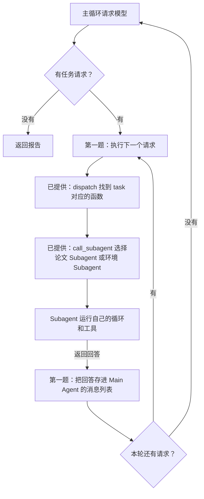
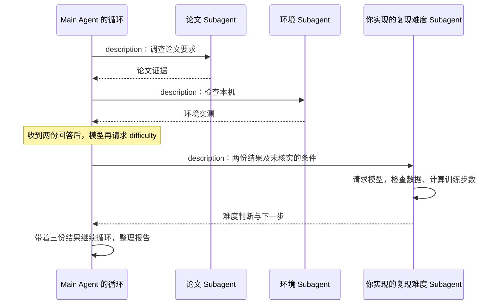

# AI Agent 开发实操课: Subagent

你打算借助 Agent 复现一篇论文，却不知道该先让它做什么：模型和训练设置要从论文哪里查？机器的配置是否可以支撑实验？准备哪些数据？如何配置环境先查清这些问题，才能安排后面的代码和实验。

本课用这个场景练习 Subagent 开发。**你要补全的是 Agent 程序：在主循环中调用 Subagent，再自己创建一个带有工具的 Subagent。** Main Agent 负责分配任务和汇总回答；三个 Subagent 各司其职，负责衡量难度，检查环境配置，阅读论文。

你可以用仓库中的[AlexNet 论文 PDF](../examples/alexnet/paper.pdf)测试你写的程序。

> **补充知识：AlexNet** AlexNet 是一种用于图像分类的深层卷积神经网络。Alex Krizhevsky、Ilya Sutskever 和 Geoffrey Hinton 在 2012 年的论文 [《ImageNet Classification with Deep Convolutional Neural Networks》](https://papers.nips.cc/paper/2012/file/c399862d3b9d6b76c8436e924a68c45b-Paper.pdf)中介绍了它。同年，团队以该模型为基础的参赛系统赢得 ImageNet 大规模视觉识别挑战赛（ILSVRC 2012）的图像分类冠军，展示了用 GPU 训练深层网络处理大规模图像分类的能力。这篇文章宣告 Deep Learning 这个技术路线的成功，引爆了之后的大模型时代。我想世界历史会以这个时间点作为一个重要节点。

这次的实操作业分成两题，都在 `main.py` 中。第一题先调用已经写好的 Subagent，第二题再创建新的 Subagent：

| 题目                          | 已经提供                                           | 你要实现                                                                                           |
| ----------------------------- | -------------------------------------------------- | -------------------------------------------------------------------------------------------------- |
| 第一题：调用两个 Subagent     | 论文 Subagent、环境 Subagent，以及它们的工具和循环 | 补全 `MainAgent.run()`：执行模型提出的任务请求，把两个 Subagent 的回答交回主循环                   |
| 第二题：增加复现难度 Subagent | `knowledge/difficulty.md`、数据目录检查和训练步数计算工具 | 实现 `MainAgent.run_difficulty()`：读取工作说明，创建 Subagent，运行任务并返回回答 |

补全后的程序应通过工具完成下面三项调查。第一题完成前两项，第二题增加第三项：

1. **论文 Subagent 查论文要求。** 读取 PDF，查清 AlexNet 的模型结构、数据量和训练设置，返回结论及原文页码。
2. **环境 Subagent 检查极其环境配置。** 调用工具检查 PyTorch 和可用设备，并运行已提供的 AlexNet 单步实验：用一批随机数据完成前向计算、反向传播和一次参数更新。
3. **复现难度 Subagent 判断还缺什么。** 接收前两份回答，检查指定的数据目录、按已查到的训练参数计算步数，再说明哪些条件已检查、哪些仍未核实。

Main Agent 根据这些返回结果生成报告，已提供的入口代码会将报告保存到 `output/report.md`。**作业验收看的是你修改的代码和实际调用过程，只有一份报告不能证明完成了作业。** 你还需要运行测试，确认主循环确实调用了 Subagent，并把它们的回答交回模型。

前面的课讲过，Agent 开发就是在 loop 里加条件：有工具请求就执行，把结果交回模型，再进入下一轮；没有工具请求就返回答案。这次要接上的，是循环中的 Subagent 调用。Main Agent 分配任务后等待，Subagent 运行自己的循环并返回回答，Main Agent 再带着这份回答继续。

> **什么时候需要多个 Agent，什么时候一个就够了？**
>
> 可以先问：**另一个 Agent 带来了原先那次回答没有用到的证据吗？** 重读同一段文字可能发现问题，但多了一次讨论并不等于多了一份证据。测试结果、渲染截图和外部查询结果，只有类似这样路径获取的文本才提供了可以核对的材料。
>
> **多 Agent 协作方式的信息增量对比**
>
> | 协作方式 | 是否引入新证据 | 能帮助检查什么 |
> | --- | --- | --- |
> | 同一模型重读自己的输出 | 没有新增外部证据 | 检查表述和推理，也可能重复原有错误 |
> | 不同 Agent 讨论同一段文本 | 若都只看原文，就没有新增外部证据 | 比较不同解释；结论仍需核实 |
> | Agent 根据测试结果审查代码 | 有执行结果 | 检查测试覆盖的行为是否符合要求 |
> | Agent 查看渲染截图，审查前端或 PPT | 有视觉结果 | 检查页面是否重叠、截断或排版错误 |
> | Agent 用外部工具核对事实 | 有查询结果 | 用来源核对原来的说法 |
>
> 这些方法是否有效，要看具体任务和检查是否可靠，不能只凭 Agent 数量判断。单个 Agent 也能调用上述工具。本课拆出论文 Subagent 和环境 Subagent，是让它们分别处理一项任务，并在各自本次运行的消息列表里记录工具结果，最后只把回答交给 Main Agent。

> **Question：Subagent 的上下文是否和 Main Agent 共享？**

> **Question**: 一群 Agent 一起写代码然后抽一个最好的 v.s. 一半的 Agent 写代码 + 一半的 Agent 写测试 & 给代码纠错，哪个效果好？

> **多 Agent 有哪些分工模式？**
>
> 本课采用的是**管理者模式**：Main Agent 决定把任务交给谁，Subagent 完成后把结果交回来，下一步仍由 Main Agent 决定。另一种是**去中心化交接**：一个 Agent 把后续工作交给另一个 Agent，由后者接着处理，不必每一步都回到同一个管理者。[OpenAI 的 Agent 开发指南](https://cdn.openai.com/business-guides-and-resources/a-practical-guide-to-building-agents.pdf#page=17)区分了这两种方式。
>
> 2026 年 7 月，**Graph Engineering** 这个说法受到关注。它讨论的是怎样把执行流程设计成图：方框表示一个工作步骤，箭头表示接下来执行什么、满足什么条件才能继续；同时规定各步骤传递哪些数据。方框里仍然可以运行我们熟悉的 Agent loop。[LangChain 在 7 月 22 日的文章](https://www.langchain.com/blog/3-years-of-graph-engineering-with-langgraph)解释了这个说法，也指出这种做法早已有之。
>
> 所以，Graph Engineering 不等于去中心化。管理者统一分配任务，也可以画成图；Agent 之间直接交接，也可以画成图。是否有管理者、消息怎样共享，是设计时要分别决定的两件事。

> **Agent 虚拟文件系统的四类区域**
>
> 如果要为多个 Agent 安排文件访问，可以参考下面四类区域。它们可以同时存在；表中的权限和保留时间是一种设计，需要由程序实现。
>
> | 区域 | 谁能访问 | 保留多久 | 读写 | 多个 Agent 同时修改时怎么办 |
> | --- | --- | --- | --- | --- |
> | Agent 专属工作区 | 仅该 Agent | 随 Agent 实例销毁 | 读写 | 私有区域，不需要协调其他 Agent |
> | 多 Agent 共享空间 | 所有协作 Agent 和用户 | 随任务保留，需要保存到持久存储 | 读写 | 需要协调，例如乐观锁或 worktree |
> | 外部挂载资源 | 由外部授权决定 | 由外部资源决定 | 多为只读，写入需谨慎 | 由外部资源负责 |
> | 系统内置资源 | 所有 Agent | 跨会话保留 | 只读 | 不会同时写入，不需要协调 |
>
> 乐观锁是在写入前检查文件有没有被别人改过，避免覆盖对方的修改；Git worktree 则让各个 Agent 先在不同的代码目录中修改，再合并结果。
>
> **本项目直接读取本地文件，使用的是内置资料和外部输入这两类资源。** 按用途可以对照表中的“系统内置资源”和“外部挂载资源”，但本课没有另做虚拟文件系统或挂载操作：
>
> - **外部资源**：你通过 `--pdf`、`--code` 指定的论文和源码文件，由论文 Subagent 读取；通过 `--dataset` 指定的数据目录，由复现难度 Subagent 检查。工具只读取这些文件或检查目录，不修改它们。
> - **内置资源**：仓库自带 AlexNet 论文 PDF，以及 `knowledge/` 中的 `paper.md`、`environment.md`、`difficulty.md` 三份工作说明。这些文件会一直保存在仓库中，程序运行时只读取。本课按分工提供资料：论文给论文 Subagent，每份工作说明加载给对应的 Subagent，并非表中“所有 Agent 都能访问”的完整实现。
>
> 本课没有为每个 Agent 建立专属文件目录，也没有让它们通过共享文件交换结果。Subagent 的回答通过函数返回值交给 Main Agent；`output/report.md` 则由 `main.py` 在调查结束后统一保存。各自的 `messages` 是内存中的对话记录，不是文件工作区。Subagent 按顺序运行，也没有写文件工具，因此这里不需要锁或 worktree 来协调它们的文件修改。

> **OpenAI 的 Navier–Stokes（NS）方程研究用了哪种模式？花了多少钱？**
>
> OpenAI 在 2026 年 9 月 8 日报告，其多 Agent 系统找到了光滑外力作用下 NS 方程有限时间爆破的证明。这里“爆破”是指数学解在有限时间内出现速度无界增长。
>
> 按[官方披露](https://openai.com/index/navier-stokes-solution/)，Agent 被分成多个组，组内可以通信，各组探索不同思路；研究团队再用 Codex 汇总有用的中间结果，交给其他组继续研究。可以把这种做法描述为**分组协作、跨组汇总**，但官方没有把它命名为某种固定模式，不能直接断言它就是去中心化或 Graph Engineering。
>
> 得到 NS 结果的组有**约一万个并发 Agent**；从首批 Agent 启动到得到结果，经过了**约 88 小时**，之后用 Lean 做形式化与验证又用了 **17 小时**。证明搜索使用内部模型，官方明确后续 Lean 阶段使用 GPT-6 Astra；没有披露实际费用，也没有说明后 17 小时仍有一万个并发 Agent。
>
> 下面另作一个课堂假设：一万个 Agent 全部使用 GPT-6 Astra，连续工作 $88+17=105$ 小时。在后面的用量假设下，模型费用约为 **1,300 万美元**。这不是这次研究实际采用的配置。
>
> API 按 token 用量收费，只有运行时长还算不出费用。这里假设每个 Agent 平均每秒生成 **50 个计费输出 token**，累计输入量为输出量的 **2 倍**。按 [OpenAI 官方价格](https://developers.openai.com/api/docs/models/gpt-6-astra)（2026-09-17 查询），标准模式下每百万输入 token 为 **10 美元**，输出为 **50 美元**；本次按每个请求的输入不超过 272K token、输入均未命中缓存计算。
>
> - 输出量：$10,000 \times 105 \times 3,600 \times 50 = 1,890$ 亿 token，费用 **945 万美元**。
> - 输入量：$1,890 \times 2 = 3,780$ 亿 token，费用 **378 万美元**。
> - 合计：$945+378=1,323$ 万美元，约 **1,300 万美元**。
>
> 每秒 50 token 和输入输出比都是为了估算而选的数值，不是 Astra 的实测速率。保持其他假设不变，每秒速率改成 25 或 100 token，费用就分别约为 **660 万或 2,650 万美元**。这里仅算模型 token 费用，不含工具和运行环境费用，也不代表 OpenAI 这次研究的实际成本。

回到第一题：先找到已经写好的两个 Subagent，再看主循环怎样调用它们。

## 1. 先看已经写好的两个 Subagent

打开 `main.py`，找到 `build_parent()`。这里准备了两个 Subagent：

| Subagent                   | 工作说明                   | 能调用的工具                                                                             |
| -------------------------- | -------------------------- | ---------------------------------------------------------------------------------------- |
| paper，论文 Subagent       | `knowledge/paper.md`       | 读取 PDF、查找关键词；可读取指定源码，启用 AlexNet 实验时还可读取 torchvision 的模型实现 |
| environment，环境 Subagent | `knowledge/environment.md` | 检查 PyTorch 和可用设备；选择 AlexNet 实验时还能运行模型单步检查                         |

每个 Subagent 都是一个 `Agent` 对象。创建时，把模型调用对象、工作说明和工具交给它；调用它的 `run(任务)`，它就进入 `agent.py` 中已经写好的循环：请求模型，有工具请求就执行，再把结果交回模型。

这里“请求模型”指通过 API 请求语言模型。它负责选择工具和生成回答；本机实验运行的是 torchvision 的 AlexNet 实现，两者用途不同。

`build_parent()` 返回 Main Agent。如果将它命名为 `parent`，那么 `parent.subagents["paper"]` 就是论文 Subagent。调用它的 `run("读取论文第 1 页，说明研究的问题")` 后，模型会收到这个任务及可用工具说明，再决定调用工具还是直接回答。

这两个 Subagent 共用 API 客户端，但各自使用自己的工作说明和工具。每次调用 `run()`，都会新建消息列表，所以环境 Subagent 不会自动看到论文 Subagent 读过的文字。

## 2. 第一题：让主循环调用它们

打开 `main.py` 的 `MainAgent.run()`。外层 `for _ in range(self.max_turns)` 负责一轮轮请求模型；内层 `for call in calls` 负责逐个执行本轮的工具请求。第一题补的是内层循环中的 TODO。模型请求和最终回答的处理都已写好。

`MainAgent(Agent)` 表示 Main Agent 可以使用 `Agent` 已提供的方法，例如执行工具的 `dispatch()`。但它有自己的 `run()`：Main Agent 执行 `MainAgent.run()`，Subagent 执行 `Agent.run()`。这次只改前者。

Main Agent 通过名为 `task` 的工具分配工作。模型返回工具名和参数，由 Python 代码执行。例如，同一轮可以收到下面两个请求。这里用函数调用的样子简写，实际请求保存在回复的 `tool_calls` 字段中：

```text
task(agent_type="paper", description="查清模型结构和训练设置，注明页码")
task(agent_type="environment", description="检查 PyTorch 和本机可用设备")
```

`agent_type` 指定找谁，`description` 说明让它做什么。模型也可能分两轮提出这两个请求，所以不能在循环里写死“先调用一次 paper，再调用一次 environment”。你要逐个执行模型本轮给出的请求。

### 请求怎样找到 Subagent？

这一步已经写好，你可以沿着下面三处代码看：

| 位置                  | 做什么                                                                           |
| --------------------- | -------------------------------------------------------------------------------- |
| `self.dispatch(call)` | 根据工具名找到函数、检查参数，再调用函数；这里的 dispatch 就是“执行这次工具请求” |
| `task` 的 `handler`   | 保存 `self.call_subagent` 这个函数；handler 表示实际要执行的函数                 |
| `call_subagent()`     | 按 agent_type 找到 Subagent，调用它的 run，等待回答                              |

所以，执行一个有效的 `task` 请求时，`self.dispatch(call)` 会沿着这几步进入 Subagent 的 `run()`，等它返回后再继续主循环。如果 `dispatch` 返回了错误信息，也要把它作为工具结果交回模型。



### 你要补什么？

找到 `for call in calls:` 下的第一题 TODO，替换掉 `raise NotImplementedError(...)`，完成两件事：

1. 调用 `self.dispatch(call)` 执行当前请求，取得回答或错误信息。
2. 把返回值作为一条工具结果，追加到 `messages`。

消息要包含这三个字段：

| 字段         | 填什么                                              |
| ------------ | --------------------------------------------------- |
| role         | 字符串 `"tool"`，表示这是工具返回的结果             |
| tool_call_id | 当前请求的 `call["id"]`，让模型知道回答对应哪个请求 |
| content      | `self.dispatch(call)` 返回的回答或错误信息          |

完成本轮所有请求后，继续循环，把这些回答发给 Main Agent 的模型。不要在收到第一份 Subagent 回答时就 `return`：它只是调查的一部分，Main Agent 还要根据结果继续工作。

一次 `run()` 执行期间，Subagent 用自己的消息列表记录模型回复和工具结果；这不是保存在磁盘上的长期记录。Main Agent 只接收它返回的回答，不要把两边的消息列表合在一起。

### 检查第一题

在仓库目录运行：

```bash
uv sync --locked
uv run pytest -m exercise1 -q
```

这些测试用预设回复代替 API 返回，并用可检查的替代函数测试部分工具调用。它们检查：

- 请求是否传到两个 Subagent，是否执行了各自对应的工具函数。
- 两份回答是否都进入主循环，是否对应正确的请求 id。
- 一轮请求两个 Subagent、分两轮请求，以及交换请求顺序时，是否都能完成。
- Subagent 的原始工具记录是否留在自己的消息列表里。

这些测试检查的是 Python 调用和消息传递，不会运行真实 PyTorch 实验。第一题未完成时，相关测试会失败。通过后，再安装 PyTorch、配置密钥，接入真实模型运行第一题：

```bash
uv sync --locked --extra ml
# 已有 .env 就跳过复制；打开文件，填入 DEEPSEEK_API_KEY
cp -n .env.example .env
uv run --extra ml python main.py --exercise 1 --trace
```

这条命令默认使用仓库中的 AlexNet 论文 PDF，并向环境 Subagent 提供单步实验工具。工具是否调用，仍由模型提出请求。查看 `--trace` 打印的任务、工具请求和结果，确认论文读取和实验都实际执行了，再检查 `output/report.md` 是否据此写出了结论。还要找到两个 Subagent 返回后，Main Agent 继续请求模型的位置。第一题不调用复现难度 Subagent，可以独立运行。

## 3. 第二题：实现复现难度 Subagent

确认第一题已读到论文要求、完成本机检查后，还需要判断接下来做什么。例如，单步实验通过了，但你指定的数据目录是否具备预期结构？按论文给出的样本数、训练轮数和每批样本数，要更新多少次参数？第二题增加一个 Subagent，让它结合前两份回答调用工具，再给出有依据的建议。

打开 `MainAgent.run_difficulty(description)`，根据函数中的说明，用你的实现替换末尾的 `raise NotImplementedError(...)`。Main Agent 的工作说明已要求模型把前两份回答的关键证据写进 `description`；Python 代码只负责传递这个参数，不会自动补齐遗漏的内容。

工作说明已放在 `knowledge/difficulty.md`。你要像前两个 Subagent 一样，从文件读取工作说明，再创建 Subagent、运行任务并返回回答。可以参考 `build_parent()` 中读取 `knowledge/paper.md` 和 `knowledge/environment.md` 的代码。

### 读取工作说明

先打开 `knowledge/difficulty.md`。第一行“复现难度 Subagent”供进度条识别，后面规定它怎样使用论文和环境证据、何时调用两个工具，以及怎样给出建议。

`main.py` 中的 `KNOWLEDGE` 已指向这个目录。在 `run_difficulty()` 中，用 `read_text(encoding="utf-8")` 读取 `KNOWLEDGE / "difficulty.md"`，将文件内容作为 `system`。提示词只保留在 Markdown 文件中，函数负责读取和使用它。

### 创建并运行这个 Subagent

`self.difficulty_tools` 已经准备好这两个工具。用 `Agent` 创建 Subagent 时：

| 参数      | 使用什么                                     |
| --------- | -------------------------------------------- |
| model     | `self.model`，共用 Main Agent 的模型调用对象 |
| system    | 从 `knowledge/difficulty.md` 读取的文本       |
| tools     | `self.difficulty_tools`，只给它这两个工具    |
| max_turns | `self.max_turns`，限制它自己的循环次数       |

然后调用它的 `run(description)`，返回它的回答。不要直接返回写死的复现建议，也不要把 Main Agent 的 task 工具交给它。

这个 Subagent 不会自动看到前两次调查的消息。运行时检查传入的 `description`：里面应有论文中的数字和页码、本机检查结果，以及仍未核实的条件。不能只写“参考上文”，因为这个 Subagent 看不到 Main Agent 的上文。

下面画出一次可能的调用顺序。论文和环境两项可以交换顺序；复现难度 Subagent 需要等两份回答都返回后，再接收这些证据。



### 检查第二题

```bash
uv run pytest -m exercise2 -q
uv run --extra ml python main.py --exercise 2 --trace
```

上面的 `main.py` 命令没有传 `--dataset`，调用目录检查工具时应返回“未提供目录”。如果有数据，在这条命令后加 `--dataset /实际的数据目录`；数据目录下应分别有 `train/类别名/` 和 `val/类别名/` 两组子目录。

第二题测试既会单独调用你的复现难度 Subagent，也会检查三个 Subagent 一起工作的过程。它会检查发给模型的工作说明是否来自 `knowledge/difficulty.md`，再核对工具是否执行、参数是否传对、结果是否交回模型，以及新的任务是否从独立的消息列表开始。协作测试需要第一题也已完成。

预设回复能检查调用过程，不能保证真实模型始终按工作说明作出正确判断。运行后打开 `output/report.md`，对照论文、工具结果和传给复现难度 Subagent 的任务，检查结论是否有依据。

## 4. 最后验收与提交

两题完成后运行全部测试，再运行真实调用验收：

```bash
uv run pytest -q
uv run --extra ml python -m tests.smoke --exercise 2
```

如果只做完第一题，先运行 `uv run pytest -m exercise1 -q`，并把在线验收命令中的 `2` 改成 `1`。全部测试包含第二题，第一题完成时不要求它们全部通过。

在线验收会重新启动一次调查，使用真实 API，并要求 Agent 读取论文、检查环境、运行 AlexNet 单步实验。验收代码检查这些工具是否实际调用，以及本机实验是否通过；它不替你核对报告中的所有论文结论。运行需要密钥，也会消耗 API 额度。

调查返回结果后，验收会将记录写入 `output/smoke.json`，将报告写入 `output/report.md`，覆盖之前的同名输出。是否通过，要看命令结果和 `smoke.json` 中的 `checks`；有报告文件不代表验收通过。

运行和验收都支持 `--device cuda`、`--device mps`、`--device cpu`。CUDA 用于 NVIDIA GPU；MPS 是 PyTorch 在支持它的 Mac 上使用 GPU 的后端；CPU 不需要 GPU。我用 Mac 演示，你按自己的设备选择。默认 `auto` 按 CUDA、MPS、CPU 的顺序选择可用设备。明确指定的设备不可用时，实验工具返回不可用，在线验收不会通过，也不会自动改用其他设备。

课堂的 AlexNet 模型单步实验使用随机输入，完成一次前向计算、反向传播和参数更新。通过只能说明这一步跑通，不能当作达到了论文准确率。

提交修改后的 `main.py`、两题测试结果，以及第二题真实运行生成的 `output/report.md` 和 `output/smoke.json`。报告与记录用于检查你的程序怎样完成调查。结合这次调用记录回答：

1. 执行哪一行时，程序进入了 Subagent 的 `run()`？它返回后，Main Agent 接着执行哪一行？
2. Main Agent 和 Subagent 分别保存了哪些消息？
3. 复现难度 Subagent 收到了哪些论文和环境证据？哪条建议还需要进一步验证？

`agent.py`、`tools.py` 和测试都已提供，不需要修改。公开仓库暂不提供参考答案。
