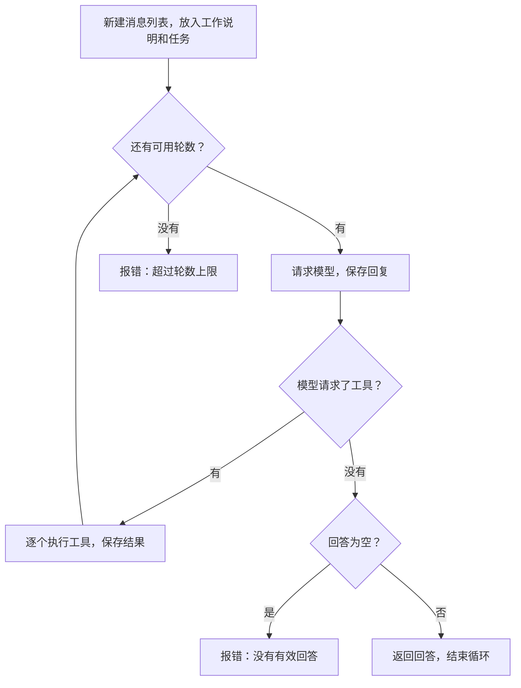
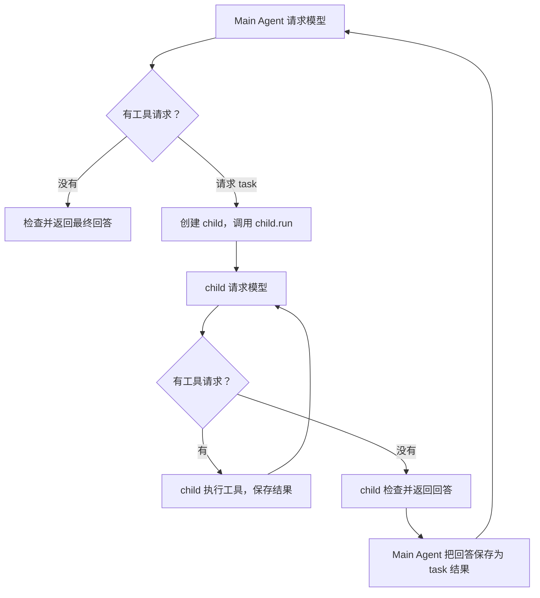
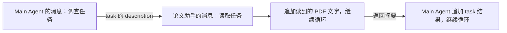

# 在 Agent loop 里调用另一个 Agent

前面我们说过，Agent 开发就是在 loop 里加条件：每次收到模型回复，都要判断接下来执行什么、要不要继续。

这节课沿用这条循环，让它能调用另一个 Agent。负责分配任务的叫 Main Agent，被调用来完成一项任务的叫 Subagent。两者都执行同一个 `run()` 方法里的循环。

我们要写的是论文调查助手。你给它一份论文 PDF，它读论文、检查你的电脑，再告诉你还需要准备什么。测试时使用仓库中的 AlexNet 论文，程序也要能接收其他论文的 PDF。

## 1. 循环就在 agent.py 的 run() 里

打开 `agent.py`，找到 `Agent.run()`。其中的 `for` 就是本课的 Agent loop，每一轮请求一次模型。`max_turns` 限制最多请求多少次，避免程序一直运行下去。

模型回复后，先看它有没有请求工具：

- 有工具请求：执行工具，保存结果，再请求模型。
- 没有工具请求：检查回答是否为空；有答案就返回，空回答就报错。

这两个判断决定了循环继续还是结束。完整顺序如下，你要把它写进 `run()`：

```text
新建本次任务的消息列表
最多循环 max_turns 次：
    请求模型，保存它的回复
    如果回复中有工具请求：
        逐个执行工具，保存每个工具的结果
        进入下一轮，把这些结果发给模型
    否则：
        如果回答为空，报错
        返回回答，结束本次 run
循环次数用完还没返回，就报错
```



注意图中回到循环开头的箭头。执行完工具还没有完成任务：模型需要看到工具结果，才能决定继续查资料，还是给出答案。

## 2. 先走一遍读取论文的循环

论文保存在本地。我们已经写好了 `read_paper` 读取函数，模型只需指定页码，函数就会返回这些页的文字。你不用实现 PDF 解析，只需把工具请求交给这个函数，再把结果交回模型。

例如，论文助手可能这样完成任务：

| 轮次 | 模型回复 | 你的程序做什么 |
| --- | --- | --- |
| 第 1 轮 | 请求 read_paper，读取第 1 页 | 执行读取，保存第 1 页文字，继续循环 |
| 第 2 轮 | 请求 read_paper，再读其他页 | 执行读取，保存结果，继续循环 |
| 第 3 轮 | 给出论文摘要，没有工具请求 | 返回摘要，结束循环 |

这是示意过程，实际读哪些页、读几轮由模型决定。程序负责的是同一件事：有工具请求就执行，没有工具请求就检查回答并结束。

要让下一轮看到前面读过的内容，需要一个 `messages` 列表。它先保存工作说明和任务，之后再追加模型回复和工具结果。`run()` 每轮把当前列表发给模型，模型才能接着已有结果往下查。

这里还有一步需要你写：模型给出工具名后，怎样找到读取函数？这一步放在 `dispatch()` 中。它从当前 Agent 的 `tools` 字典里查名字，检查参数，再执行对应函数。

以读取工具为例，`Tool` 保存了下面这几项：

| 代码里的名字 | 用途 |
| --- | --- |
| name | 工具名，例如 read_paper |
| description | 告诉模型这个工具能做什么 |
| parameters | 告诉模型需要哪些参数，例如页码 |
| handler | 实际执行的函数 |

前三项通过 `schema()` 整理成 API 接受的工具说明，发送给模型。`handler` 留在本地，由 `dispatch()` 调用。论文路径在 `main.py` 创建工具时就已确定，所以模型只需传页码。

这样就能分清两个方法：`run()` 管循环和消息，`dispatch()` 执行循环里的一次工具请求。

## 3. 执行的工具也可以是另一个 Agent

读取工具返回论文文字。如果把工具的执行函数换成“让另一个 Agent 做一项任务”，它就可以返回那个 Agent 的回答。

本课把这项工具叫作 `task`。Main Agent 请求它时，要交代两件事：找哪一位助手、让它做什么。例如：

```text
工具名：task
agent_type：paper
description：读取这篇论文，查清模型结构、数据量和训练设置，注明页码。
```

收到这个请求后，Main Agent 仍然走原来的循环：发现有工具请求，调用 `dispatch()`，等待结果。它不需要另外一套循环来处理 task。

不同之处在于 `dispatch()` 找到的函数：

| 模型请求的工具 | 对应函数做什么 | 返回的结果 |
| --- | --- | --- |
| read_paper | 读取 PDF | 论文文字 |
| task | 调用 spawn_subagent，创建另一个 Agent，执行它的 run | 那个 Agent 的回答 |

因此，判断本轮“要执行什么”的地方是工具表。`main.py` 把 task 对应的函数设为 `parent.spawn_subagent`；`dispatch()` 查到 task 后，就调用这个方法。

`spawn_subagent()` 根据 `agent_type` 选工作说明和工具，创建 child，再调用 `child.run(description)`。child 随即进入同样的循环：请求模型、判断工具请求、执行工具、继续或返回。



这张图省略了空回答和轮数上限，保留了两条循环的关系。Main Agent 停在执行 task 的地方，等 child 返回；拿到结果后，它继续下一轮。

本课不让 child 再分配任务，所以创建 child 时要去掉 task 工具，也不给它传其他助手的配置。这样调用只到一层，不会一层接一层地创建下去。

## 4. 同一个 run()，怎么知道正在运行谁？

Main Agent 和 child 都是 `Agent` 类创建的对象，所以使用同一份 `run()` 代码。调用哪个对象的方法，里面的 `self` 就指向哪个对象。

| 正在执行 | self 是谁 | 使用谁的工具 |
| --- | --- | --- |
| parent.run、parent.dispatch | Main Agent | Main Agent 的工具表，里面只有 task |
| parent.spawn_subagent | Main Agent | 查它保存的助手配置，创建 child |
| child.run、child.dispatch | 当前 child | 这位助手自己的工具表 |

`parent.spawn_subagent` 已经带着 parent 这个对象。即使把这个方法存进 task 的 `handler`，调用它时 self 仍然是 parent。

在这个方法中执行 `child.run(description)`，才进入 child 的循环。child 返回后，程序回到 parent 原先停下的位置，继续用 parent 的消息和工具：

```text
parent.run 的某一轮
  → parent.dispatch 收到 task
    → parent.spawn_subagent 创建 child
      → child.run 开始自己的循环
        → child.dispatch 执行读取等工具
        → child.run 继续请求模型，直到返回回答
    → parent.spawn_subagent 返回这段回答
  → parent.dispatch 返回 task 的结果
parent.run 保存结果，进入下一轮
```

这里没有启动另一个 Agent 进程，只是在同一个程序中调用另一个对象的方法。只有执行 PyTorch 实验的工具会另开检查进程；它与创建 child 是两件事。

## 5. 两条循环分别保存消息

除了工具不同，parent 和 child 的消息也要分开。你要在每次进入 `run()` 时新建 `messages`，而不是把消息一直存在同一个公共列表里。

parent 的第一条任务是用户的调查要求，child 的第一条任务是 Main Agent 给它的 description。两边各自追加模型回复和工具结果，child 结束时只返回回答文本。

因此，论文助手读过的 PDF 文字留在自己的列表中，Main Agent 下一轮拿到的是 task 返回的论文摘要：



这也决定了下一项任务必须写清楚什么。难度助手看不到前两位的消息，Main Agent 需要把论文设置和环境结果写进给它的 description，不能只说“根据刚才的结果判断”。

例如，论文中的数据量、每批样本数、训练轮数和来源页码，以及本次实验用了哪块设备、是否成功，都要传过去。没有提供数据目录，就写“未提供目录”，不能写成“电脑里没有数据”。

难度助手拿到这些信息后，才能调用工具计算训练步数、检查指定目录，再说明还需要准备或确认什么。你最后检查报告时，也要核对这些依据是否完整。

## 6. 把这条循环用在论文调查里

循环和工具调用写好后，就可以安排具体任务。本课设置了三位助手，每一位都使用同一个 `run()`，区别在于工作说明和工具：

| 助手 | 要查什么 | 已提供的工具 |
| --- | --- | --- |
| 论文助手 paper | 模型结构、数据量、训练设置和来源页码；有代码时比较实现 | 读取、搜索 PDF；读取指定源码或 AlexNet 实现 |
| 环境助手 environment | PyTorch 版本、可用设备；有配套实验时实际运行 | 环境检测、模型单步实验 |
| 难度助手 difficulty | 根据前两项结果判断下一步 | 检查数据目录、计算训练步数 |

这些工作说明放在 `knowledge/`，工具在 `main.py` 中分配。Main Agent 的说明要求它先找论文助手和环境助手，等两位返回后，再把结果交给难度助手。

“先找谁、后找谁”由模型按说明提出请求，程序按请求顺序执行。测试会检查难度助手是否过早启动；你也可以用 `--trace` 查看实际过程。

环境工具支持 CUDA、MPS 和 CPU。CUDA 用于 NVIDIA GPU，MPS 是 PyTorch 在 Mac 上使用 GPU 的后端，CPU 不需要 GPU。我用 Mac 演示，你按自己的设备选择。默认 auto 先检查 CUDA，再检查 MPS，都不可用就选 CPU。

仓库还提供了 AlexNet 单步实验。环境助手调用它后，工具会创建模型，用随机输入完成一次前向计算、反向传播和参数更新，并记录实际设备。成功只说明这一步能执行，不能当作达到了论文准确率。

这份实验是预先写好的，不会随着 PDF 内容自动生成。换其他论文时，可以继续读论文、查环境；如果还要运行那篇论文的模型，需要在 `tools.py` 添加对应实验，再在 `main.py` 分配工具。

## 7. 你需要补全的三个位置

打开 `agent.py`，按下面的分工完成三个 TODO：

| 方法 | 在循环中负责什么 |
| --- | --- |
| run | 循环请求模型；判断继续执行工具、返回答案还是报错 |
| dispatch | 执行本轮的一次工具请求，把结果交回循环 |
| spawn_subagent | 在执行 task 时创建 child，等待 child 的循环返回 |

`run()` 已经留出了 `for`，内部判断和消息保存需要你补全。工具名、参数和错误处理的具体要求见[作业说明](assignment.md)。写完后，在仓库目录运行测试：

```bash
uv sync --locked
uv run pytest -q
```

测试不调用真实模型，因此不需要密钥。它会检查：工具结果是否进入下一轮、最终回答能否结束循环、轮数用完是否报错，以及 child 的消息有没有混进 parent。

测试通过后，配置密钥，再让助手实际调查 AlexNet 论文：

```bash
uv sync --locked --extra ml
# 已有 .env 就跳过复制，直接检查里面的密钥
cp -n .env.example .env
# 打开 .env，填入 DEEPSEEK_API_KEY
uv run --extra ml python main.py --trace
```

`main.py` 默认读取 `examples/alexnet/paper.pdf`，并提供 AlexNet 单步实验。明确指定设备时，在命令末尾加 `--device cuda`、`--device mps` 或 `--device cpu`。指定的设备不可用时会报告失败，不会换到其他设备。

运行时，找到一次工具请求，看看它的结果怎样进入下一轮；再找到一次 task，看看 child 怎样开始循环、返回后 parent 怎样继续。最后打开 `output/report.md`，对照论文和工具结果检查结论。
