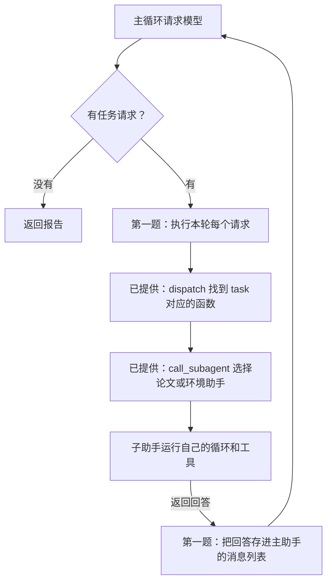
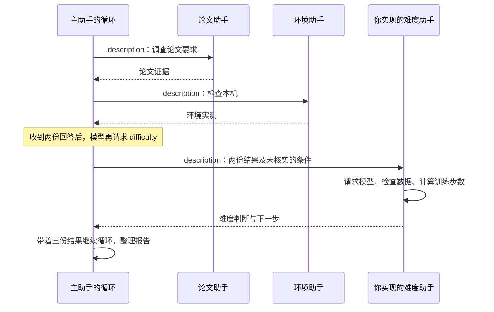

# AI Agent 开发实操课: Subagent

这节课要完成一个**论文复现调查助手**。你打算借助 Agent 复现 AlexNet，但还不知道该怎样安排代码和实验。先让助手读论文、检查你的电脑，弄清论文要求什么、本机已经能做什么，再据此列出还需要准备的条件。

课堂使用仓库里已经放好的 [AlexNet 原论文](../examples/alexnet/paper.pdf)。两题完成后，程序会把调查报告写入 `output/report.md`，回答三个问题：

1. **论文怎么做的？** 查清 AlexNet 的模型结构、数据量和训练设置，注明原文页码。
2. **本机能运行什么？** 检查 PyTorch 和可用设备，并运行已提供的 AlexNet 单步实验。这个实验用随机输入完成一次前向计算、反向传播和参数更新。
3. **接下来还缺什么？** 根据前两项结果，检查指定的数据目录、计算训练步数，说明距离按论文设置训练和核对论文指标还需要哪些准备。

本课要交付的是这份调查报告。完整训练 AlexNet、达到论文准确率，是调查之后的工作；单步实验通过，只能说明这一步能在本机执行。程序也能接收其他论文的 PDF，但目前配套的模型实验只有 AlexNet。

为了完成调查，作业分成两题，都在 `main.py` 中：

| 题目 | 已经提供 | 你要实现 |
| --- | --- | --- |
| 第一题：调用两个子助手 | 论文助手、环境助手，以及它们的工具和循环 | 补全 `MainAgent.run()`：执行模型提出的任务请求，把两个助手的回答交回主循环 |
| 第二题：增加难度助手 | 数据目录检查、训练步数计算工具 | 实现 `MainAgent.run_difficulty()`：写工作说明，创建助手，让它根据前两份结果调用工具并给出建议 |

前面的课讲过，Agent 开发就是在 loop 里加条件：有工具请求就执行，把结果交回模型，再进入下一轮；没有工具请求就返回答案。这次要接上的，是循环中的子助手调用。Main Agent 分配任务后等待，Subagent 运行自己的循环并返回回答，Main Agent 再带着这份回答继续。

> **什么时候需要多个 Agent，什么时候一个就够了？**
>
> 图中给出的判断依据是：**协作过程是否引入了单个 Agent 在生成时无法获得的新信息？** 也就是，另一个 Agent 能否提供原先生成回答时没有的证据？如果只是让同一个模型重读自己的答案，或者让几个 Agent 围着同一段文字讨论，并不等于多了一份可靠依据。测试结果、渲染截图和外部工具的检查结果，才让它们有机会发现原先没看到的问题。
>
> **多 Agent 协作方式的信息增量对比**
>
> | 协作方式 | 是否引入新信息 | 资料中的效果概括 |
> | --- | --- | --- |
> | 同一模型自我审查，重新阅读自己的输出 | 否 | 通常无效，甚至有害 |
> | 不同 Agent 辩论同一段文本 | 否 | 在相同计算量下，与单个 Agent 持平 |
> | 审核者根据测试执行结果审查代码 | 是，执行反馈 | 显著提升 |
> | 审核者查看渲染截图，审查前端或 PPT 代码 | 是，视觉反馈 | 显著提升 |
> | 审核者使用外部工具验证事实 | 是，工具反馈 | 显著提升 |
>
> 放到本课里，论文助手要读 PDF 原文，环境助手要实际检查电脑，主助手才能拿到论文要求和本机条件这两份证据。单个 Agent 也可以调用这些工具；拆成子助手，是为了让它们各自完成一项工作、分别保存阅读和检查记录。是否值得拆分，还要看这些分工能否改善结果，以及多出的调用成本。

> **Question：Subagent 的上下文是否和 Main Agent 共享？**
>
> 本课不共享完整对话。这里的上下文，指每次请求模型时发给它的消息。Main Agent 和 Subagent 分别维护自己的 `messages`：主助手把任务写进 `description` 传过去，子助手完成后只返回回答。子助手不会自动看到主助手之前的对话，主助手也不会自动拿到子助手读过的全部原文。
>
> 因此，要让难度助手参考论文和环境结果，主助手就得把这些信息写进任务里。共用 API 客户端不会让消息自动共享；其他系统也可以选择传递完整历史或共用资料，具体取决于代码怎样传数据。

> **这种分工叫作什么？**
>
> 本课采用的是**管理者模式**：Main Agent 决定把任务交给谁，Subagent 完成后把结果交回来，下一步仍由 Main Agent 决定。另一种是**去中心化交接**：一个 Agent 把后续工作交给另一个 Agent，由后者接着处理，不必每一步都回到同一位管理者。[OpenAI 的 Agent 开发指南](https://cdn.openai.com/business-guides-and-resources/a-practical-guide-to-building-agents.pdf#page=17)区分了这两种方式。
>
> 2026 年 7 月，**Graph Engineering** 这个说法受到关注。它讨论的是怎样把执行流程设计成图：方框表示一个工作步骤，箭头表示接下来执行什么、满足什么条件才能继续；同时规定各步骤传递哪些数据。方框里仍然可以运行我们熟悉的 Agent loop。[LangChain 在 7 月 22 日的文章](https://www.langchain.com/blog/3-years-of-graph-engineering-with-langgraph)解释了这个说法，也指出这种做法早已有之。
>
> 所以，Graph Engineering 不等于去中心化。管理者统一分配任务，也可以画成图；Agent 之间直接交接，也可以画成图。是否有管理者、消息怎样共享，是设计时要分别决定的两件事。

> **OpenAI 的 Navier–Stokes（NS）方程研究用了哪种模式？**
>
> OpenAI 在 2026 年 9 月 8 日报告，其多智能体系统找到了光滑外力作用下 NS 方程有限时间爆破的证明。这里“爆破”是指数学解在有限时间内出现速度无界增长。
>
> 按[官方披露](https://openai.com/index/navier-stokes-solution/)，Agent 被分成多个组，组内可以通信，各组探索不同思路；研究团队再用 Codex 汇总有用的中间结果，交给其他组继续研究。可以把这种做法描述为**分组协作、跨组汇总**，但官方没有把它命名为某种固定模式，不能直接断言它就是去中心化或 Graph Engineering。
>
> 得到 NS 结果的组有**约一万个并发 Agent**；从首批 Agent 启动到得到结果，经过了**约 88 小时**，之后用 Lean 做形式化与验证又用了 **17 小时**。假设这一万个 Agent 都使用 GPT-6 Astra，连续工作 $88+17=105$ 小时，模型费用可以粗估为 **1,300 万美元左右**，计算假设如下。
>
> API 按 token 用量收费，只有运行时长还算不出费用。这里假设每个 Agent 平均每秒生成 **50 个计费输出 token**，累计输入量为输出量的 **2 倍**。按 [OpenAI 官方价格](https://developers.openai.com/api/docs/models/gpt-6-astra)（2026-09-17 查询），标准模式下每百万输入 token 为 **10 美元**，输出为 **50 美元**；本次按每个请求的输入不超过 272K token、输入均未命中缓存计算。
>
> - 输出量：$10,000 \times 105 \times 3,600 \times 50 = 1,890$ 亿 token，费用 **945 万美元**。
> - 输入量：$1,890 \times 2 = 3,780$ 亿 token，费用 **378 万美元**。
> - 合计：$945+378=1,323$ 万美元，约 **1,300 万美元**。
>
> 每秒 50 token 和输入输出比都是为了估算而选的数值，不是 Astra 的实测速率。保持其他假设不变，每秒速率改成 25 或 100 token，费用就分别约为 **660 万或 2,650 万美元**。这里仅算模型 token 费用，不含工具和运行环境费用，也不代表 OpenAI 这次研究的实际成本。

下面从已经写好的论文助手和环境助手开始，看看它们怎样调查 AlexNet，再把它们接进主循环。

## 1. 先看已经写好的两个助手

打开 `main.py`，找到 `build_parent()`。这里准备了两个子助手：

| 子助手                | 工作说明                   | 能调用的工具                                                     |
| --------------------- | -------------------------- | ---------------------------------------------------------------- |
| paper，论文助手       | `knowledge/paper.md`       | 读取 PDF、查找关键词；提供源码时还能读取代码                     |
| environment，环境助手 | `knowledge/environment.md` | 检查 PyTorch 和可用设备；选择 AlexNet 实验时还能运行模型单步检查 |

每个助手都是一个 `Agent` 对象。创建时，把模型、工作说明和工具交给它；调用它的 `run(任务)`，它就开始请求模型、执行工具，最后返回回答。这个循环在 `agent.py` 里，已经写好。

例如，`parent.subagents["paper"]` 存着论文助手。它的 `run("读取论文第 1 页，说明研究的问题")` 会让模型决定怎样使用读取工具，不是直接返回一段事先写好的摘要。

这两个助手共用 API 客户端，但各自使用自己的工作说明和工具。每次调用 `run()`，都会新建消息列表，所以环境助手不会自动看到论文助手读过的文字。

## 2. 第一题：让主循环调用它们

打开 `main.py` 的 `MainAgent.run()`。这里的 `for` 就是要修改的主循环。模型请求和最终回答的处理都已写好，缺的是收到任务请求后怎样执行。

`MainAgent(Agent)` 表示主助手可以使用 `Agent` 已提供的方法，例如执行工具的 `dispatch()`。但它有自己的 `run()`：主助手执行 `MainAgent.run()`，子助手执行 `Agent.run()`。这次只改前者。

主助手通过名为 `task` 的工具分配工作。例如，模型可能在同一轮请求：

```text
task(agent_type="paper", description="查清模型结构和训练设置，注明页码")
task(agent_type="environment", description="检查 PyTorch 和本机可用设备")
```

`agent_type` 指定找谁，`description` 说明让它做什么。模型也可能分两轮提出这两个请求，所以不能在循环里写死“先调用一次 paper，再调用一次 environment”。你要逐个执行模型本轮给出的请求。

### 请求怎样找到子助手？

这一步已经写好，你可以沿着下面三处代码看：

| 位置                  | 做什么                                                                           |
| --------------------- | -------------------------------------------------------------------------------- |
| `self.dispatch(call)` | 根据工具名找到函数、检查参数，再调用函数；这里的 dispatch 就是“执行这次工具请求” |
| `task` 的 `handler`   | 保存 `self.call_subagent` 这个函数；handler 表示实际要执行的函数                 |
| `call_subagent()`     | 按 agent_type 找到子助手，调用它的 run，等待回答                                 |

因此，在主循环里执行 `self.dispatch(call)`，最终会进入对应子助手的 `run()`。这行调用返回时，子助手已经完成任务，返回值就是它的回答。



### 你要补什么？

找到 `for call in calls:` 下的第一题 TODO，替换掉 `raise NotImplementedError(...)`，完成两件事：

1. 执行当前请求，取得子助手的回答。
2. 把回答作为一条工具结果，追加到 `messages`。

消息要包含这三个字段：

| 字段         | 填什么                                              |
| ------------ | --------------------------------------------------- |
| role         | 字符串 `"tool"`，表示这是工具返回的结果             |
| tool_call_id | 当前请求的 `call["id"]`，让模型知道回答对应哪个请求 |
| content      | 刚刚得到的子助手回答                                |

完成本轮所有请求后，继续循环，把这些回答发给主助手的模型。不要在收到第一份子助手回答时就 `return`：它只是调查的一部分，主助手还要根据结果继续工作。

子助手读取的 PDF 原文、检查环境的工具记录，都保存在子助手自己的消息列表中。主助手拿到的是它最后返回的回答，不要把两边的消息列表合在一起。

### 检查第一题

在仓库目录运行：

```bash
uv sync --locked
uv run pytest -m exercise1 -q
```

测试会让模型按预设顺序提出任务请求，并检查：

- 论文、环境助手是否都实际运行了各自的工具。
- 两份回答是否都进入主循环，是否对应正确的请求 id。
- 一轮请求两个助手、分两轮请求，以及交换请求顺序时，是否都能完成。
- 子助手的原始工具记录是否留在自己的消息列表里。

测试使用预设回复，是为了稳定检查你的代码。通过后，还要接入真实模型运行第一题：

```bash
uv sync --locked --extra ml
# 已有 .env 就跳过复制；打开文件，填入 DEEPSEEK_API_KEY
cp -n .env.example .env
uv run --extra ml python main.py --exercise 1 --trace
```

这条命令读取仓库中的 AlexNet 论文，并启用 AlexNet 单步实验。第一题完成后，`output/report.md` 应包含论文要求和本机实测结果。看终端记录，找到两个助手开始工作的位置，以及它们返回后主助手发起下一轮请求的位置。第一题不调用难度助手，不需要先完成第二题。

## 3. 第二题：实现复现难度助手

第一题的报告已经有 AlexNet 的论文要求和本机检查结果，但还没有专门检查复现所需的其他条件。例如，本机完成了随机输入上的单步实验，真实训练数据是否已经准备好？按论文中的样本数、训练轮数和每批样本数，总共需要多少次参数更新？第二题的难度助手要根据这些证据给出下一步建议。

第二题让你写一位助手完成这项判断。打开 `MainAgent.run_difficulty(description)`，替换第二题的 TODO。主助手会把前两位的关键结果写进 description，再调用这个方法。

你需要自己写这位助手的工作说明、创建它，并运行它的任务。可以参考 `build_parent()` 中前两个助手的创建方式，以及 `agent.py` 中 `Agent` 的参数。

### 写清楚它要做什么

工作说明第一行用“复现难度助手”，供进度条识别。后面用你自己的话说明：

- 根据 description 中的论文和环境证据判断，不凭记忆补写论文设置。
- 调用 `inspect_dataset` 检查指定的数据目录；未提供目录时，不能说电脑里没有数据。
- 样本数、训练轮数、每批样本数齐全时，调用 `training_workload` 计算训练步数；缺数据就说明缺什么。
- 区分“模型单步跑通”“完成论文规模的训练”“达到论文指标”，给出依据和下一步。

检查和计算函数都已提供。你的工作是让这位助手知道什么时候使用它们、怎样根据结果回答，不需要再写一套目录扫描或计算代码。

### 创建并运行这位助手

`self.difficulty_tools` 已经准备好这两个工具。用 `Agent` 创建助手时：

| 参数      | 使用什么                                  |
| --------- | ----------------------------------------- |
| model     | `self.model`，继续使用同一个模型客户端    |
| system    | 你写的工作说明                            |
| tools     | `self.difficulty_tools`，只给它这两个工具 |
| max_turns | `self.max_turns`，限制它自己的循环次数    |

然后调用它的 `run(description)`，返回它的回答。不要直接返回写死的复现建议，也不要把主助手的 task 工具交给它。

这位助手不会自动看到前两位的消息。因此主助手必须把论文中的数据量、训练设置和来源页码，以及本机实测结果、未核实的条件写进 description。第二题的主助手工作说明已经要求它这样做，你要在实际运行时检查它有没有传完整。



### 检查第二题

```bash
uv run pytest -m exercise2 -q
uv run --extra ml python main.py --exercise 2 --trace
```

第二题测试既会单独调用你的难度助手，也会检查三位助手一起工作的过程。它会核对工具是否实际执行、参数是否传对、结果是否交回模型，以及新的任务是否从独立的消息列表开始。协作测试需要第一题也已完成。

预设回复能检查调用过程，不能证明你写的工作说明会让真实模型始终作出正确判断。运行后打开 `output/report.md`，对照论文、工具结果和传给难度助手的任务，检查结论是否有依据。

## 4. 最后验收与提交

两题完成后运行全部测试，再运行真实调用验收：

```bash
uv run pytest -q
uv run --extra ml python -m tests.smoke --exercise 2
```

如果只验收第一题，把最后的 `2` 改成 `1`。在线验收会重新调查 AlexNet，调用 API、读取论文、运行本机模型实验；需要密钥，也会消耗 API 额度。记录保存在 `output/smoke.json`，报告保存在 `output/report.md`。

运行和验收都支持 `--device cuda`、`--device mps`、`--device cpu`。CUDA 用于 NVIDIA GPU，MPS 用于支持它的 Mac GPU，CPU 不需要 GPU。我用 Mac 演示，你按自己的设备选择。默认 auto 依次检查 CUDA、MPS、CPU；明确指定的设备不可用时会报错，不会偷偷切换。

AlexNet 实验使用随机输入，完成一次前向计算、反向传播和参数更新。通过只能说明这一步跑通，不能当作达到了论文准确率。

提交修改后的 `main.py`、两题测试结果和第二题调查报告，并结合一次调用记录回答：

1. 主助手在哪一行等待子助手？子助手返回后，主循环接着执行哪里？
2. 主助手和子助手分别保存了哪些消息？
3. 难度助手收到了哪些论文和环境证据？哪条建议还需要进一步验证？

`agent.py`、`tools.py` 和测试都已提供，不需要修改。公开仓库暂不提供参考答案。
