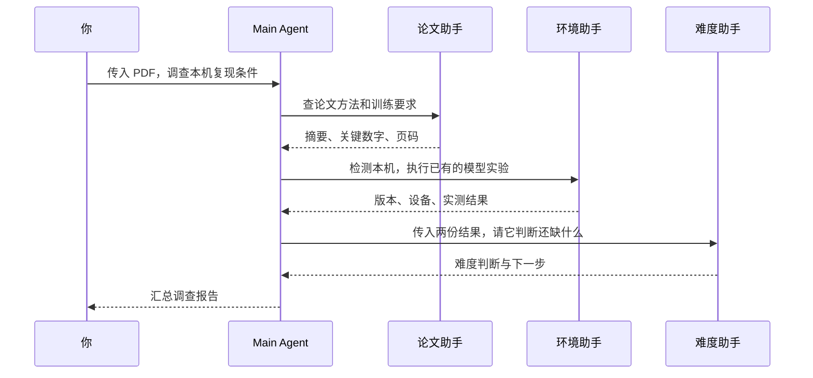
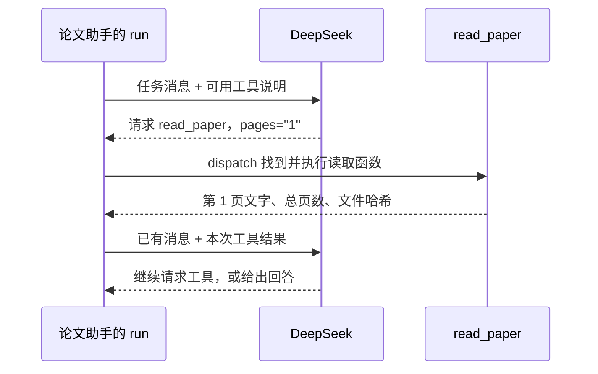
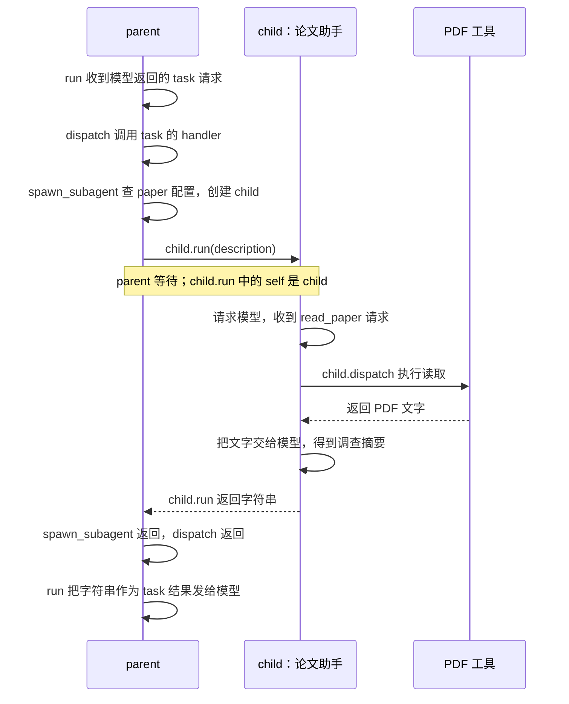
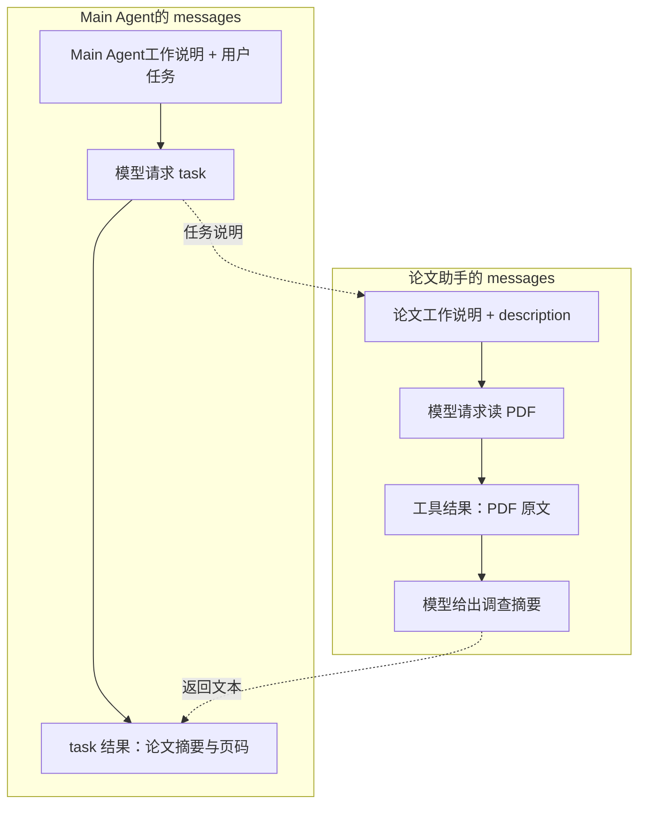

# 用 Subagent 完成论文复现前的调查

你打算借助 Agent 复现一篇论文，却无从下手：该先让它读论文、写代码，还是准备环境？写代码需要知道模型结构，准备环境需要知道计算要求，所以先让它把这些条件查清楚：

> 读这份论文 PDF，查清模型和训练要求，再检查我的电脑，告诉我目前能做哪些实验、还缺什么条件。

本课要写的程序接收这项任务，返回一份调查报告。我们用 AlexNet 练习，代码仍然接收用户指定的 PDF。下面按一次调查的调用顺序讲解代码；完成末尾的作业后，就能按 [README](../README.md#以-alexnet-论文为例运行调查助手) 运行它。

## 1. 谁读论文，谁检查环境？

要判断本机能做什么，必须先知道论文要求什么、本机具备什么条件。这两项分别查完，才能比较差距，因此调查需要三类工作：

| 工作 | 需要的材料或工具 | 返回的结果 |
| --- | --- | --- |
| 读论文 | PDF；可选的实现代码 | 模型结构、训练设置、来源页码、实现差异 |
| 查环境 | 本机检测工具；已提供的模型实验 | 依赖版本、可用设备、实验结果 |
| 评估难度 | 前两项结果；可选的数据目录 | 当前能做哪一步，还缺哪些条件 |

这些工作可以交给一个 Agent 顺序完成。本课把它们分给三个 Agent，是为了给每一位配置不同的检查要求和工具：读论文的只需查原文，检查环境的需要运行本机检测。另设一个 Main Agent 分配任务、收集结果，被它调用的这三个 Agent 就叫 Subagent。

Main Agent 先安排读论文和查环境，拿到两份结果后，再交给难度助手。读论文和查环境谁先做都可以，下图选取其中一种顺序：



代码用 `paper`、`environment`、`difficulty` 标识三种 Subagent。它们都请求 DeepSeek，但各自的工作说明来自不同的 `knowledge/*.md` 文件，工具也由 `main.py` 分别配置。比如，论文助手需要核对训练设置的页码，环境助手需要检查实际运行设备；这些要求要靠各自的工具才能落实。

## 2. 论文助手怎样调用读取工具？

先看论文助手。它拿到“读取论文”的任务后，需要从本地 PDF 中提取文字。本程序通过 API 发送消息，没有把 PDF 文件直接发给模型，因此提供了 `read_paper` 工具，让模型选择要读的页码，再由 Python 读取。

负责这个过程的是 `Agent` 对象。它的 `model` 用来请求 DeepSeek，`system` 保存工作说明，`tools` 保存可用工具；调用 `run(任务说明)` 后，它才开始请求模型。这里的 `model` 是语言模型的 API 适配器，后面实验中的 AlexNet 则是待检查的神经网络。

第一次请求会带上任务、工作说明和工具说明。DeepSeek 看到可以按页读论文，便可以返回读取请求，例如下面这两个字段表示读第 1 页：

```python
{"name": "read_paper", "arguments": '{"pages":"1"}'}
```

这还没有执行任何读取。`run()` 收到请求后，把它交给 `dispatch()`；`dispatch()` 根据工具名找到 Python 函数，传入页码，再把读取结果返回给 `run()`。`run()` 保存模型请求和工具结果，在下一次请求中一起发送，模型才知道第 1 页写了什么。



模型可能接着请求其他页，也可能给出答案。因此 `run()` 需要循环执行“请求模型、执行工具、保存结果”，直到收到不含工具请求的有效回答。你要写的 `run()` 和 `dispatch()`，分别负责这层循环和其中的一次工具执行。

`dispatch()` 怎样从工具名找到执行函数？项目用 `Tool` 保存这两者的对应关系。下面是读论文工具的配置，省略了导入和路径设置：

```python
Tool(
    name="read_paper",
    description="读取 PDF 页码",
    parameters=string_args("pages"),
    handler=lambda pages: read_paper(pdf, pages),
)
```

`name` 是工具名，`description` 说明用途，`parameters` 描述参数；这里的 `string_args("pages")` 表示 pages 是必填字符串。`schema()` 将这三项生成 API 所需的工具说明，所以模型能知道该用什么名字、传什么参数。

`handler` 则留在 Python 中，保存实际执行的函数。`dispatch()` 调用它时，pages 来自模型请求，pdf 来自启动参数 `--pdf`，已经在创建工具时绑定。因此模型只需选择页码，不必再传文件路径。完整请求还包含调用 id，程序靠它把工具结果对应到请求，具体格式见[作业说明](assignment.md#第一题执行工具请求)。

## 3. 把读取函数换成一次 Subagent 调用

论文助手已经能通过工具读 PDF，接下来要让 Main Agent 调用这个助手。普通工具的执行函数可以返回 PDF 文字，那么另一种执行函数也可以先运行一个 Agent，再返回它的回答。

项目把后一种工具命名为 `task`。启动入口 `__main__.py` 先调用 `build_parent()` 创建 Main Agent，再执行 `parent.run(用户任务)`。parent 的工具表只有 task，模型要分配论文任务时，就会请求它。

task 用 `agent_type` 选择专家，用 `description` 交代任务。下面用函数调用的写法表示请求内容；API 实际返回的仍是工具名和 JSON 参数：

```python
task(
    agent_type="paper",
    description="读取这篇论文，查清模型结构、数据量、batch size、epoch 和硬件，注明页码。",
)
```

这个任务要求查数据量、batch size 和 epoch，因为估算训练工作量需要知道每批多少样本、整个训练集要遍历多少轮。其中 batch size 是每批样本数，epoch 是遍历训练集的轮数。任务可以直接说“这篇论文”，因为 paper 的读取工具已绑定用户提供的 PDF。

Main Agent 收到 task 请求后，也会交给自己的 `dispatch()`。它找到的 handler 是 `build_parent()` 创建工具时绑定的方法：

```python
handler = parent.spawn_subagent
```

所以执行 handler 就进入 `parent.spawn_subagent(agent_type, description)`，此时方法中的 self 是 parent。parent 的 `specialists` 保存三种专家配置；`spawn_subagent()` 先按 agent_type 找到配置，再用里面的工作说明和工具创建 child。

下面展示创建和调用 child 的部分。spec 是选中的专家配置，`child_tools` 是复制该专家的工具表、排除 task 后得到的字典：

```python
spec = self.specialists[agent_type]
child = Agent(
    self.model,
    spec.system,
    child_tools,
    max_turns=self.max_turns,
)
summary = child.run(description)
```

执行 `child.run(description)` 后，child 就按上一节的循环请求模型、读取 PDF，直到返回回答。这段回答依次经过 `spawn_subagent()` 和 `dispatch()`，最后成为 Main Agent 收到的 task 结果。

| 工具 | handler 执行什么 | 返回什么 |
| --- | --- | --- |
| read_paper | 读取指定 PDF 的页码 | 提取出的文字和来源信息 |
| task | 创建 child，调用 child.run | child 的回答 |

两种工具都能交给同一个 `dispatch()` 处理，因为对它来说，工作都是找到 handler、传入参数、收回结果。task 额外做的事都在 `spawn_subagent()` 里面。

本课只让 Main Agent 分配子任务，所以 child 的工具表排除 task，也不传入 specialists。每次 task 都创建一个新 child；即使模型同时请求多个 task，Python 也会逐个执行，等当前 child 返回再继续。

## 4. parent 和 child 用同一份方法，self 会不会混？

上一节中，parent 和 child 都调用了 `run()` 和 `dispatch()`。它们确实使用同一个 Agent 类的方法，但调用时的对象不同，self 也就不同：

| 调用 | self 指向谁 | 使用的工具或配置 |
| --- | --- | --- |
| parent.run / parent.dispatch | parent | task |
| parent.spawn_subagent | parent | 从自己的 specialists 中查专家配置 |
| child.run / child.dispatch | child | 当前专家的工具 |

`parent.spawn_subagent` 已经绑定 parent，保存到 handler 后不会改变。因此 Main Agent 的 dispatch 调用这个 handler，进入方法后 self 仍然是 parent。

直到执行 `child.run(description)`，程序才进入以 child 为 self 的那次调用。parent 的调用停在那里等待；child 返回后，parent 从原处继续，仍然使用自己的工具和配置。



因此，创建 Subagent 在这里就是创建一个 Python 对象，再调用它的方法。parent 和 child 共用 model 对象请求 API，工作说明和工具表则分别保存。环境检测工具还会启动一个 PyTorch 检查进程，那是工具内部的实现，不是上图中创建 child 的操作。

## 5. child 读过的内容，parent 能看到多少？

上图中 child 最后返回的是字符串。它在回答前可能读了好几页论文，这些读取结果保存在自己的 `run()` 中，没有随返回值一起交给 parent。

具体来说，每次进入 `run()`，程序都新建一个 messages 列表，先放工作说明和任务：

```python
messages = [
    {"role": "system", "content": self.system},
    {"role": "user", "content": prompt},
]
```

后续模型回复和工具结果都追加到这个列表，每次请求模型时发送当前列表。parent.run 的 prompt 是用户任务，child.run 的 prompt 是 description；两次调用各有一个列表，所以 child 不会自动继承 parent 的历史。

child 查完后，parent 只把它返回的回答保存为 task 结果。这样，PDF 原文留在 child 的消息中，Main Agent 后续请求携带的是调查摘要：



难度助手也会从新的 messages 开始，因此它看不到论文助手和环境助手的历史。Main Agent 必须把两份结果写进交给它的 description，不能只说“根据刚才的结果判断”。

例如，[教师 Mac 上的 AlexNet 记录](../examples/alexnet/checked-report.md)包含约 120 万训练样本、batch 128、约 90 轮，以及 MPS 单步检查通过、未提供数据目录。交给难度助手时，除了这些结论，还要带上论文页码和实验限制。学生使用自己的实测结果，不照搬教师的设备。

难度助手拿到训练设置后，调用 `training_workload` 计算步数，再通过 `inspect_dataset` 检查用户指定的数据目录。没有提供目录时，结果是“未配置”，只能说明本次没有检查数据，不能说明电脑里没有数据。

这也是摘要要保留来源和未知条件的原因：少传一项，下一位助手就少一项判断依据。Main Agent 发现依据不足时可以安排补查，但摘要和最终报告仍可能写错，需要对照工具记录核查。

## 6. 环境助手返回的实验结果从哪里来？

难度判断还依赖环境结果，因此再看环境助手这一支。它先调用 `inspect_environment`，取得 Python、PyTorch、torchvision 版本，以及 CUDA、MPS 是否可用。

这些设备对应不同的运行方式。学生可以使用 CUDA、MPS 或 CPU，教师用 Mac 只是其中一个例子：

| 设备 | 用途 | 检查方法 |
| --- | --- | --- |
| CUDA | 使用 NVIDIA GPU | torch.cuda.is_available()；需要硬件、驱动和 PyTorch 支持 |
| MPS | 使用支持 MPS 的 Mac GPU | torch.backends.mps.is_available() |
| CPU | 使用 CPU，不需要 GPU | 在 CPU 上执行相同实验 |

MPS 是 PyTorch 在 Mac 上使用 GPU 的后端，安装和检测方法见 [MPS 文档](https://docs.pytorch.org/docs/stable/notes/mps.html)。CUDA 安装包和驱动则要与本机匹配，见 [PyTorch 安装页](https://pytorch.org/get-started/locally/)。无论选哪种设备，检测可用之后还需要实际运行模型，才能确认这份实现能否执行。

运行实验前，用 `--device` 指定设备。默认 auto 先检查 CUDA，再检查 MPS，都不可用就选 CPU；也可以明确指定：

```bash
# 使用 NVIDIA GPU
uv run --extra ml python main.py --device cuda
# 教师在 Mac 上演示
uv run --extra ml python main.py --device mps
# 只使用 CPU
uv run --extra ml python main.py --device cpu
```

选好设备后，还要告诉程序执行哪个模型实验。仓库已写好 AlexNet 实验，通过 `--experiment alexnet` 注册为 `run_model_check` 工具，不传 --pdf 时自动启用该实验。

`main.py` 注册工具时，也把 --device 的值绑定到 handler。因此环境助手只需请求 `run_model_check()`，不传设备参数，就会在这次指定的设备上执行：

```text
创建 torchvision AlexNet，随机初始化，不下载权重
  → 把模型放到选定的 CUDA、MPS 或 CPU 上
  → 在同一设备上生成随机输入（1×3×224×224）和目标标签
  → 前向计算、交叉熵 loss、反向传播
  → SGD 更新参数
  → 检查输出形状、loss、梯度、权重是否改变
```

前向计算得到输出，反向传播计算梯度，SGD 用梯度更新参数。工具检查这些步骤是否成功，并记录参数、输入和输出的实际设备，环境助手再据此报告结果。

明确指定 CUDA 或 MPS 后，如果设备不可用或计算失败，工具会返回失败，不会自动换 CPU。选择 CPU 并完成这些步骤，同样能通过本课验收；它证明的是一次随机输入的计算能执行，论文准确率仍需真实数据上的训练和评估。

这个实验函数只实现了 AlexNet。换一篇 PDF，读取工具会读新论文，实验函数却不会随之变成另一个模型。因此调查其他论文时，可以先只读论文、查环境；需要运行模型时，再在 `tools.py` 添加对应实验，并在 `main.py` 注册工具。

## 7. 作业要补哪三处？

现在一次调查的调用过程已经完整：Main Agent 请求 task，spawn_subagent 创建 child，child 通过 run 和 dispatch 使用自己的工具，再把回答传回 Main Agent。

作业把这三个方法留在 `agent.py` 中让你实现：

1. `dispatch`：按工具名找到 handler，检查参数并执行。
2. `run`：保存消息，循环请求模型和执行工具，直到得到回答。
3. `spawn_subagent`：按类型创建 child，调用 child.run，返回摘要。

API、专家配置和工具函数都已提供，按[作业说明](assignment.md)中的消息格式与错误约定把它们接起来即可。写完先跑离线测试，再用 AlexNet 做在线验收，最后对照 PDF 和工具输出检查报告。这三步分别检查代码调用、真实执行和结论依据。
